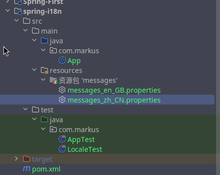
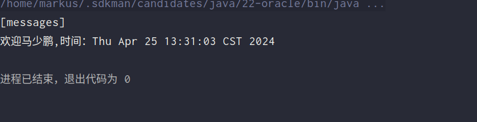

# 国际化：`i18n`


## `i18n`概述

国际化也称作`i18n`，其来源是英文单词 `internationalization`的首末字符i和n，18为中间的字符数。由于软件发行可能面向多个国家，对于不同国家的用户，软件显示不同语言的过程就是国际化。通常来讲，软件中的国际化是通过配置文件来实现的，假设要支撑两种语言，那么就需要两个版本的配置文件。

## `Java`国际化

（1）`Java`自身是支持国际化的，`java.util.Locale`用于指定当前用户所属的语言环境等信息，`java.util.ResourceBundle`用于查找绑定对应的资源文件。`Locale`包含了`language`信息和`country`信息，`Locale`创建默认`locale`对象时使用的静态方法：

```java
  /**
     * This method must be called only for creating the Locale.*
     * constants due to making shortcuts.
     */
    private static Locale createConstant(String lang, String country) {
        BaseLocale base = BaseLocale.createInstance(lang, country);
        return getInstance(base, null);
    }
```

（2）配置文件命名规则：
**`basename_language_country.properties`**
 必须遵循以上的命名规则，`java`才会识别。其中，`basename`是必须的，语言和国家是可选的。这里存在一个优先级概念，如果同时提供了`messages.properties`和`messages_zh_CN.propertes`两个配置文件，如果提供的`locale`符合`zh_CN`，那么优先查找`messages_zh_CN.propertes`配置文件，如果没查找到，再查找`messages.properties`配置文件。最后，提示下，所有的配置文件必须放在`classpath`中，一般放在`resources`目录下

### 演示Java国际化

 

#### 测试

```java
package com.markus;

import org.junit.jupiter.api.Test;

import java.util.Locale;
import java.util.ResourceBundle;

public class LocaleTest {
    @Test
    public void testLocale()
    {
        ResourceBundle resourceBundle = ResourceBundle.getBundle("messages",new Locale("en","GB"));
        System.out.println(resourceBundle.getString("test"));
        ResourceBundle ResourceBundles =ResourceBundle.getBundle("messages",new Locale("zh","CN"));
        System.out.println(ResourceBundles.getString("test"));
    }
}
```

#### 注意

**`.properties`文件默认不支持中文，最好改为`UTF-8`编码**

## `Spring6`国际化

### `MessageSource`接口

`spring`中国际化是通过`MessageSource`这个接口来支持的

**常见实现类**

**`ResourceBundleMessageSource`**

这个是基于`Java`的`ResourceBundle`基础类实现，允许仅通过资源名加载国际化资源

**`ReloadableResourceBundleMessageSource`**

这个功能和第一个类的功能类似，多了定时刷新功能，允许在不重启系统的情况下，更新资源的信息

**`StaticMessageSource`**

它允许通过编程的方式提供国际化信息，一会我们可以通过这个来实现db中存储国际化信息的功能。

### 使用`Spring6`国际化

#### 创建对应的`properties`文件

`messages_zh_CN.properties`

```properties
Start_Message =欢迎{0}，时间：{1}
```

`messages_zh_CN.properties`

```properties
Start_Message=Welcome{0},Time:{1}
```

`application.properties`

```properties
messages.basename=messages
messages.defaultEncoding=UTF-8
```


#### 配置`MessageResource`信息

##### 基于`XML`方式

```xml
<?xml version="1.0" encoding="UTF-8"?>
<beans xmlns="http://www.springframework.org/schema/beans"
       xmlns:xsi="http://www.w3.org/2001/XMLSchema-instance"
       xsi:schemaLocation="http://www.springframework.org/schema/beans http://www.springframework.org/schema/beans/spring-beans.xsd">
    <bean id="messageSource" class="org.springframework.context.support.ResourceBundleMessageSource">
        <property name="basenames">
            <list>
                <value>messages</value>
            </list>
        </property>
        <property name="defaultEncoding">
            <value>UTF-8</value>
        </property>
    </bean>
  </beans>
```

##### 基于注解方式

```java
package com.markus.Config;

import org.springframework.beans.factory.annotation.Autowired;
import org.springframework.context.annotation.Bean;
import org.springframework.context.annotation.ComponentScan;
import org.springframework.context.annotation.Configuration;
import org.springframework.context.annotation.PropertySource;
import org.springframework.context.support.ReloadableResourceBundleMessageSource;
import org.springframework.core.env.Environment;

@Configuration
@ComponentScan(basePackages = "com.markus")
@PropertySource("classpath:application.properties")
public class MyConfig {
    @Autowired
    private Environment environment;
    @Bean
    public ReloadableResourceBundleMessageSource messageSource(){
        ReloadableResourceBundleMessageSource messageSource = new ReloadableResourceBundleMessageSource();
        messageSource.setBasename(environment.getProperty("messages.basename"));
        messageSource.setDefaultEncoding(environment.getProperty("messages.defaultEncoding"));
        return messageSource;
    }
}

```

##### 注意

**`id`必须是`messageSource`这是`Spring`的规定**

#### 测试

```java
package com.markus;

import com.markus.Config.MyConfig;
import org.junit.jupiter.api.Test;
import org.springframework.context.ApplicationContext;
import org.springframework.context.annotation.AnnotationConfigApplicationContext;
import org.springframework.context.support.ClassPathXmlApplicationContext;

import java.util.Date;
import java.util.Locale;

public class LocaleTest {
//    @Test
//    public void testLocale()
//    {
//        ResourceBundle resourceBundle = ResourceBundle.getBundle("messages",new Locale("en","GB"));
//        System.out.println(resourceBundle.getString("test"));
//        ResourceBundle ResourceBundles =ResourceBundle.getBundle("messages",new Locale("zh","CN"));
//        System.out.println(ResourceBundles.getString("test"));
//    }
    @Test
    public void testLocale2()
    {
        ApplicationContext context = new AnnotationConfigApplicationContext(MyConfig.class);
        Object[] objects = new Object[]{"马少鹏",new Date().toString()};
        String string;
        string = context.getMessage("Start_Message",objects,Locale.CHINA);
        System.out.println(string);
    }
    public static void main(String[] args) {
        ApplicationContext context = new ClassPathXmlApplicationContext("beans.xml");
        Object[] objects= new Object[]{"markus",new Date().toString()};
        String string= context.getMessage("Start_Message",objects,new Locale("en","GB"));
        System.out.println(string);
    }
}
```

#### 结果


