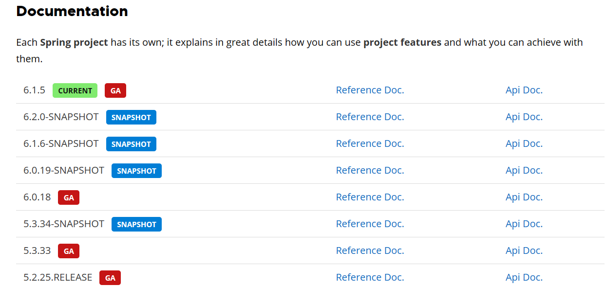

# Spring介绍

## `Spring`是什么

Spring 是一款主流的 Java EE 轻量级开源框架 ，Spring 由“Spring 之父”Rod Johnson 提出并创立，其目的是用于简化 Java 企业级应用的开发难度和开发周期。Spring的用途不仅限于服务器端的开发。从简单性、可测试性和松耦合的角度而言，任何Java应用都可以从Spring中受益。Spring 框架除了自己提供功能外，还提供整合其他技术和框架的能力。

Spring 自诞生以来备受青睐，一直被广大开发人员作为 Java 企业级应用程序开发的首选。时至今日，Spring 俨然成为了 Java EE 代名词，成为了构建 Java EE 应用的事实标准。

自 2004 年 4 月，Spring 1.0 版本正式发布以来，Spring 已经步入到了第 6 个大版本，也就是 Spring 6。本课程采用Spring当前最新发布的正式版本**6.1.5**。

## `Spring`的狭义与广义

广义上的 Spring 泛指以 Spring Framework 为核心的 Spring 技术栈。

经过十多年的发展，Spring 已经不再是一个单纯的应用框架，而是逐渐发展成为一个由多个不同子项目（模块）组成的成熟技术，例如 Spring Framework、Spring MVC、SpringBoot、Spring Cloud、Spring Data、Spring Security 等，其中 Spring Framework 是其他子项目的基础。

这些子项目涵盖了从企业级应用开发到云计算等各方面的内容，能够帮助开发人员解决软件发展过程中不断产生的各种实际问题，给开发人员带来了更好的开发体验。

**狭义的 Spring：Spring Framework**

狭义的 Spring 特指 Spring Framework，通常我们将它称为 Spring 框架。

Spring 框架是一个分层的、面向切面的 Java 应用程序的一站式轻量级解决方案，它是 Spring 技术栈的核心和基础，是为了解决企业级应用开发的复杂性而创建的。

Spring 有两个最核心模块： IoC 和 AOP。

**IoC**：Inverse of Control 的简写，译为“控制反转”，指把创建对象过程交给 Spring 进行管理。

**AOP**：Aspect Oriented Programming 的简写，译为“面向切面编程”。AOP 用来封装多个类的公共行为，将那些与业务无关，却为业务模块所共同调用的逻辑封装起来，减少系统的重复代码，降低模块间的耦合度。另外，AOP 还解决一些系统层面上的问题，比如日志、事务、权限等。

## `Spring Framework`特点

- 非侵入式：使用 Spring Framework 开发应用程序时，Spring 对应用程序本身的结构影响非常小。对领域模型可以做到零污染；对功能性组件也只需要使用几个简单的注解进行标记，完全不会破坏原有结构，反而能将组件结构进一步简化。这就使得基于 Spring Framework 开发应用程序时结构清晰、简洁优雅。

- 控制反转：IoC——Inversion of Control，翻转资源获取方向。把自己创建资源、向环境索取资源变成环境将资源准备好，我们享受资源注入。

- 面向切面编程：AOP——Aspect Oriented Programming，在不修改源代码的基础上增强代码功能。

- 容器：Spring IoC 是一个容器，因为它包含并且管理组件对象的生命周期。组件享受到了容器化的管理，替程序员屏蔽了组件创建过程中的大量细节，极大的降低了使用门槛，大幅度提高了开发效率。

- 组件化：Spring 实现了使用简单的组件配置组合成一个复杂的应用。在 Spring 中可以使用 XML 和 Java 注解组合这些对象。这使得我们可以基于一个个功能明确、边界清晰的组件有条不紊的搭建超大型复杂应用系统。

- 一站式：在 IoC 和 AOP 的基础上可以整合各种企业应用的开源框架和优秀的第三方类库。而且 Spring 旗下的项目已经覆盖了广泛领域，很多方面的功能性需求可以在 Spring Framework 的基础上全部使用 Spring 来实现。

## `Spring`模块组成

### ①`Spring Core`（核心容器）

`spring core`提供了`IOC`,`DI`,`Bean`配置装载创建的核心实现。核心概念： `Beans`、`BeanFactory`、`BeanDefinitions`、`ApplicationContext`。

- `spring-core` ：`IOC`和`DI`的基本实现

- `spring-beans`：`BeanFactory`和`Bean`的装配管理(`BeanFactory`)
- `spring-context`：`Spring context`上下文，即`IOC`容器(`AppliactionContext`)
- `spring-expression`：`spring`表达式语言

### ②`Spring AOP`

- spring-aop：面向切面编程的应用模块，整合ASM，CGLib，JDK Proxy
- spring-aspects：集成AspectJ，AOP应用框架
- spring-instrument：动态Class Loading模块

### ③`Spring Data Access`

- spring-jdbc：spring对JDBC的封装，用于简化jdbc操作
- spring-orm：java对象与数据库数据的映射框架
- spring-oxm：对象与xml文件的映射框架
- spring-jms： Spring对Java Message Service(java消息服务)的封装，用于服务之间相互通信
- spring-tx：spring jdbc事务管理

### ④`Spring Web`

- spring-web：最基础的web支持，建立于spring-context之上，通过servlet或listener来初始化IOC容器
- spring-webmvc：实现web mvc
- spring-websocket：与前端的全双工通信协议
- spring-webflux：Spring 5.0提供的，用于取代传统java servlet，非阻塞式Reactive Web框架，异步，非阻塞，事件驱动的服务

### ⑤`Spring Message`

- Spring-messaging：spring 4.0提供的，为Spring集成一些基础的报文传送服务

⑥`Spring test`

- spring-test：集成测试支持，主要是对junit的封装