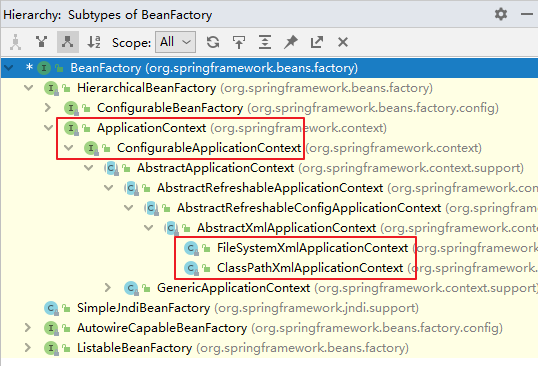

# `IOC`和`Bean`

`IoC`也被称为依赖注入（`DI`）。它是一个过程，对象仅通过构造参数、工厂方法的参数或在对象实例被构造或从工厂方法返回后在其上设置的属性来定义其依赖关系（即它们与之合作的其他对象）。然后容器在创建` bean` 时注入这些依赖关系。这个过程从根本上说是Bean本身通过使用直接构建类或诸如服务定位模式的机制来控制其依赖关系的实例化或位置的逆过程（因此被称为控制反转）。

- 控制反转是一种思想。
- 控制反转是为了降低程序耦合度，提高程序扩展力。
- 控制反转，反转的是什么？

- - 将对象的创建权利交出去，交给第三方容器负责。
  - 将对象和对象之间关系的维护权交出去，交给第三方容器负责。

- 控制反转这种思想如何实现呢？

- - DI（Dependency Injection）：依赖注入

`org.springframework.beans` 和 `org.springframework.context` 包是Spring Framework的`IoC`容器的基础。 [`BeanFactory`](https://docs.spring.io/spring-framework/docs/6.0.8-SNAPSHOT/javadoc-api/org/springframework/beans/factory/BeanFactory.html) 接口提供了一种高级配置机制，能够管理任何类型的对象。 [`ApplicationContext`](https://docs.spring.io/spring-framework/docs/6.0.8-SNAPSHOT/javadoc-api/org/springframework/context/ApplicationContext.html) 是 `BeanFactory` 的一个子接口。它增加了：

- 更容易与Spring的`AOP`功能集成
- Message resource 处理（用于国际化）
- 事件发布
- 应用层的特定上下文，如 `WebApplicationContext`，用于 web 应用

简而言之，`BeanFactory` 提供了配置框架和基本功能，而 `ApplicationContext` 则增加了更多的企业特定功能。`ApplicationContext` 是 `BeanFactory` 的一个完整的超集，在本章对Spring的`IoC`容器的描述中专门使用。

在Spring中，构成你的应用程序的骨干并由`Spring IoC`容器管理的对象被称为Bean。Bean是一个由Spring IoC容器实例化、组装和管理的对象。否则，Bean只是你的应用程序中众多对象中的一个。Bean以及它们之间的依赖关系都反映在容器使用的配置元数据中。

## 容器概述

`org.springframework.context.ApplicationContext` 接口代表`Spring IoC`容器，负责实例化、配置和组装bean。容器通过读取配置元数据来获得关于要实例化、配置和组装哪些对象的指示。配置元数据以XML、Java注解或Java代码表示。它可以让你表达构成你的应用程序的对象以及这些对象之间丰富的相互依赖关系。

Spring 的 `IoC `容器就是` IoC`思想的一个落地的产品实现。IoC容器中管理的组件也叫做 bean。在创建 bean 之前，首先需要创建IoC 容器。Spring 提供了`IoC `容器的两种实现方式：

**①`BeanFactory`**

这是` IoC` 容器的基本实现，是` Spring` 内部使用的接口。面向 `Spring` 本身，不提供给开发人员使用。

**②`ApplicationContext`**

`BeanFactory` 的子接口，提供了更多高级特性。面向 `Spring` 的使用者，几乎所有场合都使用 `ApplicationContext` 而不是底层的 `BeanFactory`。

**③`ApplicationContext`的主要实现类**

|              `class`              |                                                              |
| :-------------------------------: | :----------------------------------------------------------: |
| `ClassPathXmlApplicationContext ` |   通过读取类路径下的 XML 格式的配置文件创建` IOC` 容器对象   |
| `FileSystemXmlApplicationContext` |  通过文件系统路径读取 XML 格式的配置文件创建 `IOC `容器对象  |
| `ConfigurableApplicationContext ` | `ApplicationContext` 的子接口，包含一些扩展方法 `refresh() `和 `close()` ，让` ApplicationContext` 具有启动、关闭和刷新上下文的能力。 |
|     `WebApplicationContext `      | 专门为 Web 应用准备，基于 Web 环境创建` IOC` 容器对象，并将对象引入存入` ServletContext` 域中。 |

