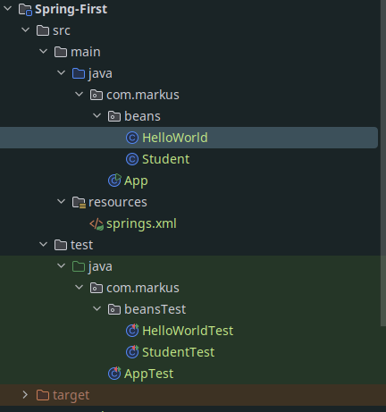
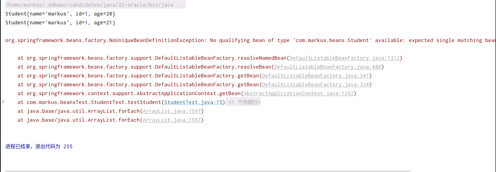
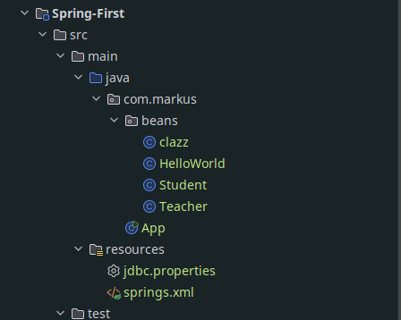

# 基于`XML`管理`Bean`

## `XML`文件导入`Bean`



`Student.java`

```java
package com.markus.beans;

import java.util.Objects;

public class Student {
    private String  name;
    private Integer id;

    @Override
    public String toString() {
        return "Student{" +
                "name='" + name + '\'' +
                ", id=" + id +
                ", age=" + age +
                '}';
    }

//    public Student() {
//    }

    private Integer age;

    public void setName(String name) {
        this.name = name;
    }

    @Override
    public boolean equals(Object o) {
        if (this == o) return true;
        if (!(o instanceof Student)) return false;
        Student student = (Student) o;
        return Objects.equals(name, student.name) && Objects.equals(id, student.id) && Objects.equals(age, student.age);
    }

    @Override
    public int hashCode() {
        return Objects.hash(name, id, age);
    }

    public void setId(Integer id) {
        this.id = id;
    }

    public void setAge(Integer age) {
        this.age = age;
    }

    public String getName() {
        return name;
    }

    public Integer getId() {
        return id;
    }

    public Integer getAge() {
        return age;
    }

    public Student(String name, Integer age, Integer id) {
        this.name = name;
        this.age = age;
        this.id = id;
    }
}
```

`beans.xml`

```xml
<?xml version="1.0" encoding="UTF-8"?>
<beans xmlns="http://www.springframework.org/schema/beans"
       xmlns:xsi="http://www.w3.org/2001/XMLSchema-instance"
       xsi:schemaLocation="http://www.springframework.org/schema/beans http://www.springframework.org/schema/beans/spring-beans.xsd">
   <bean id="student" class="com.markus.beans.Student">
       <constructor-arg index="0" value="markus"/>
       <constructor-arg index="1" value="20"/>
       <constructor-arg index="2" value="001"/>
   </bean>
    <bean id="students" class="com.markus.beans.Student">
        <constructor-arg index="0" value=""/>
        <constructor-arg index="1" value=""/>
        <constructor-arg index="2" value=""/>
        <property name="name" value="markus"/>
        <property name="age" value="20"/>
        <property name="id" value="001"/>
    </bean>
</beans>
```

`TestStudent.java`

```java
package com.markus.beansTest;

import com.markus.beans.Student;
import org.junit.jupiter.api.Test;
import org.springframework.context.support.ClassPathXmlApplicationContext;

public class StudentTest {
    @Test
    public void testStudent(){
        ClassPathXmlApplicationContext context = new ClassPathXmlApplicationContext("springs.xml");
        Student student = context.getBean("student", Student.class);
        System.out.println(student);
        Student students = context.getBean("students", Student.class);
        System.out.println(students);
        Student Error = context.getBean(Student.class);
        System.out.println(Error);
    }
}

```

运行结果



`<bean></bean>`代表一个`bean`对象

```xml
<bean id="student" class="com.packageName.className"></bean>
```

## 获取`bean`对象

```java
ClassPathXmlApplicationContext context = new ClassPathXmlApplicationContext("beans.xml");
Student student =(Student)context.getBean(name="student",{Student.class});
```

`ClassPathXmlApplicationContext context = new ClassPathXmlApplicationContext("xxx.xml");`读取类路径下的`xml`文件

`context.getBean()`获取指定`Bean`对象

- `context.getBean(name)`
  - `name`即`xml`文件中`<bean></bean>`的`id`属性

- `context.getBean(String name,class<T> clazz);`
  - `class<T>clazz`获取对象所属的类文件，即`<bean></bean>`的`class`属性的类名`.class`
  - `name`即`xml`文件中`<bean></bean>`的`id`属性

- `context.getBean(class<T> clazz);`
  - `class<T>clazz`获取对象所属的类文件，即`<bean></bean>`的`class`属性的类名`.class`
    - 只通过`class<T> clazz`获取`bean`对象时，`bean`对象同一个类，最好只有一个

如果组件类实现了接口，根据接口类型可以获取 bean 吗？

> 可以，前提是bean唯一

如果一个接口有多个实现类，这些实现类都配置了 bean，根据接口类型可以获取 bean 吗？

> 不行，因为bean不唯一

## 依赖注入

### `Setter`注入

`Student.class`

```java
package com.markus.beans;

import java.util.Objects;

public class Student {
    private String  name;
    private Integer id;

    @Override
    public String toString() {
        return "Student{" +
                "name='" + name + '\'' +
                ", id=" + id +
                ", age=" + age +
                '}';
    }

//    public Student() {
//    }

    private Integer age;

    public void setName(String name) {
        this.name = name;
    }

    @Override
    public boolean equals(Object o) {
        if (this == o) return true;
        if (!(o instanceof Student)) return false;
        Student student = (Student) o;
        return Objects.equals(name, student.name) && Objects.equals(id, student.id) && Objects.equals(age, student.age);
    }

    @Override
    public int hashCode() {
        return Objects.hash(name, id, age);
    }

    public void setId(Integer id) {
        this.id = id;
    }

    public void setAge(Integer age) {
        this.age = age;
    }

    public String getName() {
        return name;
    }

    public Integer getId() {
        return id;
    }

    public Integer getAge() {
        return age;
    }

//    public Student(String name, Integer age, Integer id) {
//        this.name = name;
//        this.age = age;
//        this.id = id;
//    }
}
```

`Bean`配置`xml`

```xml
<bean id="students" class="com.markus.beans.Student">
        <property name="name" value="markus"/>
        <property name="age" value="21"/>
        <property name="id" value="001"/>
</bean>
```

### 构造器注入

`Student.java`

```java
package com.markus.beans;

import java.util.Objects;

public class Student {
    private String  name;
    private Integer id;

    @Override
    public String toString() {
        return "Student{" +
                "name='" + name + '\'' +
                ", id=" + id +
                ", age=" + age +
                '}';
    }

//    public Student() {
//    }

    private Integer age;

    public void setName(String name) {
        this.name = name;
    }

    @Override
    public boolean equals(Object o) {
        if (this == o) return true;
        if (!(o instanceof Student)) return false;
        Student student = (Student) o;
        return Objects.equals(name, student.name) && Objects.equals(id, student.id) && Objects.equals(age, student.age);
    }

    @Override
    public int hashCode() {
        return Objects.hash(name, id, age);
    }

    public void setId(Integer id) {
        this.id = id;
    }

    public void setAge(Integer age) {
        this.age = age;
    }

    public String getName() {
        return name;
    }

    public Integer getId() {
        return id;
    }

    public Integer getAge() {
        return age;
    }

    public Student(String name, Integer age, Integer id) {
        this.name = name;
        this.age = age;
        this.id = id;
    }
}
```

配置`Bean`

```xml
<bean id="student" class="com.markus.beans.Student">
       <constructor-arg index="0" value="markus"/>
       <constructor-arg index="1" value="20"/>
       <constructor-arg index="2" value="001"/>
</bean>
```

> 注意：
>
> `constructor-arg`标签还有两个属性可以进一步描述构造器参数：
>
> - `index`属性：指定参数所在位置的索引（从0开始）
> - `name`属性：指定参数名

### 特殊值处理

#### 字面量赋值

> 什么是字面量？

> int a = 10;

> 声明一个变量a，初始化为10，此时a就不代表字母a了，而是作为一个变量的名字。当我们引用a的时候，我们实际上拿到的值是10。

> 而如果a是带引号的：'a'，那么它现在不是一个变量，它就是代表a这个字母本身，这就是字面量。所以字面量没有引申含义，就是我们看到的这个数据本身。

```xml
<property name="name" value="markus"/>
```

#### `NULL`

```xml
<property name="id">
    <null></null>
</property>
```

#### `XML`实体

```xml
<!-- 小于号在XML文档中用来定义标签的开始，不能随便使用 -->
<!-- 解决方案一：使用XML实体来代替 -->
<property name="expression" value="a &lt; b"/>
```

`<` =>`&lt;`

`>`=>`&gt;`

#### `CDATA`节

```xml
<property name="expression">
    <!-- 解决方案二：使用CDATA节 -->
    <!-- CDATA中的C代表Character，是文本、字符的含义，CDATA就表示纯文本数据 -->
    <!-- XML解析器看到CDATA节就知道这里是纯文本，就不会当作XML标签或属性来解析 -->
    <!-- 所以CDATA节中写什么符号都随意 -->
    <value><![CDATA[a < b]]></value>
</property>
```

### 为对象类型属性赋值

`Clazz.java`

```java
package com.markus.beans;

public class clazz {
    private Integer clazzId;
    private String ClazzName;

    @Override
    public String toString() {
        return "clazz{" +
                "clazzId=" + clazzId +
                ", ClazzName='" + ClazzName + '\'' +
                '}';
    }

    public String getClazzName() {
        return ClazzName;
    }

    public void setClazzName(String clazzName) {
        ClazzName = clazzName;
    }

    public Integer getClazzId() {
        return clazzId;
    }

    public void setClazzId(Integer clazzId) {
        this.clazzId = clazzId;
    }
}
```

`Student.java`

```java
package com.markus.beans;

import java.util.Objects;

public class Student {
    private String  name;
    private Integer id;

    //    public Student() {
//    }

    private Integer age;
    private clazz clazz;

    public com.markus.beans.clazz getClazz() {
        return clazz;
    }

    public void setClazz(com.markus.beans.clazz clazz) {
        this.clazz = clazz;
    }

    @Override
    public boolean equals(Object o) {
        if (this == o) return true;
        if (!(o instanceof Student)) return false;
        Student student = (Student) o;
        return Objects.equals(getName(), student.getName()) && Objects.equals(getId(), student.getId()) && Objects.equals(getAge(), student.getAge()) && Objects.equals(getClazz(), student.getClazz());
    }

    @Override
    public int hashCode() {
        return Objects.hash(getName(), getId(), getAge(), getClazz());
    }

    public Student(String name, Integer id, Integer age, com.markus.beans.clazz clazz) {
        this.name = name;
        this.id = id;
        this.age = age;
        this.clazz = clazz;
    }

    @Override
    public String toString() {
        return "Student{" +
                "name='" + name + '\'' +
                ", id=" + id +
                ", age=" + age +
                ", clazz=" + clazz +
                '}';
    }

    public void setName(String name) {
        this.name = name;
    }

    public void setId(Integer id) {
        this.id = id;
    }

    public void setAge(Integer age) {
        this.age = age;
    }

    public String getName() {
        return name;
    }

    public Integer getId() {
        return id;
    }

    public Integer getAge() {
        return age;
    }
    
}
```

`clazz`的`Bean`配置

```xml
<bean id="clazz" class="com.markus.beans.clazz">
       <property name="clazzName" value="2班"/>
        <property name="clazzId" value="111"/>
</bean>
```

#### 引入外部`Bean`

```xml
<bean id="student" class="com.markus.beans.Student">
        <constructor-arg index="0" value=""/>
        <constructor-arg index="1" value=""/>
        <constructor-arg index="2" value=""/>
        <constructor-arg index="3" ref="clazz"/>
        <property name="name" value="markus"/>
        <property name="age" value="18"/>
        <property name="clazz" ref="clazz"/>
        <property name="id" value="001"/>
    </bean>
```

#### 内部设置`Bean`

```xml
<bean id="studentFour" class="com.atguigu.spring6.bean.Student">
    <property name="id" value="1004"></property>
    <property name="name" value="赵六"></property>
    <property name="age" value="26"></property>
    <property name="sex" value="女"></property>
    <property name="clazz">
        <!-- 在一个bean中再声明一个bean就是内部bean -->
        <!-- 内部bean只能用于给属性赋值，不能在外部通过IOC容器获取，因此可以省略id属性 -->
        <bean id="clazzInner" class="com.atguigu.spring6.bean.Clazz">
            <property name="clazzId" value="2222"></property>
            <property name="clazzName" value="远大前程班"></property>
        </bean>
    </property>
</bean>
```

#### 级联属性赋值

```xml
<bean id="clazz" class="com.markus.beans.clazz"></bean>
<bean id="student" class="com.markus.beans.Student">
        <constructor-arg index="0" value=""/>
        <constructor-arg index="1" value=""/>
        <constructor-arg index="2" value=""/>
        <constructor-arg index="3" ref="clazz"/>
        <property name="name" value="markus"/>
        <property name="age" value="18"/>
        <property name="clazz" ref="clazz"/>
        <property name="id" value="001"/>
        <property name="clazz.clazzId" value="111"/>
        <property name="clazz.clazzName" value="2班"/>
    </bean>
```

### 为数组类型属性赋值

修改`Student.class`

```java
private String[] hobbies;

public String[] getHobbies() {
    return hobbies;
}

public void setHobbies(String[] hobbies) {
    this.hobbies = hobbies;
}
```

配置`Bean`

```xml
<bean id="studentFour" class="com.atguigu.spring.bean6.Student">
    <property name="id" value="1004"></property>
    <property name="name" value="赵六"></property>
    <property name="age" value="26"></property>
    <property name="sex" value="女"></property>
    <!-- ref属性：引用IOC容器中某个bean的id，将所对应的bean为属性赋值 -->
    <property name="clazz" ref="clazzOne"></property>
    <property name="hobbies">
        <array>
            <value>抽烟</value>
            <value>喝酒</value>
            <value>烫头</value>
        </array>
    </property>
</bean>
```

### 为集合类型属性赋值

#### 为List集合类型属性赋值

在`Clazz`类中添加以下代码：

```java
private List<Student> students;

public List<Student> getStudents() {
    return students;
}

public void setStudents(List<Student> students) {
    this.students = students;
}
```

配置`Bean`

```xml
<bean id="clazz" class="com.markus.beans.clazz">
<!--        <constructor-arg index="0" name="clazzId" value="111"/>-->
<!--        <constructor-arg index="2" name="clazzName" value="2班"/>-->
<!--        <constructor-arg index="1" name="studentList" >-->
<!--            <list>-->
<!--                <ref bean="student"/>-->
<!--                <ref bean="marry"/>-->
<!--            </list>-->
<!--        </constructor-arg>-->
        <property name="clazzName" value="2班"/>
        <property name="clazzId" value="111"/>
        <property name="studentList">
            <list>
                <ref bean="student"/>
                <ref bean="marry"/>
            </list>
        </property>
    </bean>
```

**测试时，注意不要引发循环依赖**

```xml
<bean id="student" class="com.markus.beans.Student">
<!--        <constructor-arg index="0" value=""/>-->
<!--        <constructor-arg index="1" value=""/>-->
<!--        <constructor-arg index="2" value=""/>-->
<!--        <constructor-arg index="3" ref="clazz"/>-->
        <property name="name" value="markus"/>
        <property name="age" value="18"/>
<!--        <property name="clazz" ref="clazz"/>-->
        <property name="id" value="001"/>
        <property name="hobbies">
            <array>
                <value>抽烟</value>
                <value>喝酒</value>
                <value>烫头</value>
            </array>
        </property>
    </bean>
    <bean id="marry" class="com.markus.beans.Student">
<!--        <constructor-arg index="0" value=""/>-->
<!--        <constructor-arg index="1" value=""/>-->
<!--        <constructor-arg index="2" value=""/>-->
<!--        <constructor-arg index="3" ref="clazz"/>-->
        <property name="id" value="002"/>
        <property name="name" value="mary"/>
        <property name="age" value="18"/>
<!--        <property name="clazz" ref="clazz"/>-->
        <property name="hobbies">
            <array>
                <value>抽烟</value>
                <value>喝酒</value>
                <value>烫头</value>
            </array>
        </property>
     </bean>
```


> 若为Set集合类型属性赋值，只需要将其中的list标签改为set标签即可

#### 为Map集合类型属性赋值

创建教师类`Teacher`：

```java
package com.markus.beans;

public class Teacher {
    private Integer TeacherId;
    private String TeacherName;
    public Integer getTeacherId() {
        return TeacherId;
    }

    public void setTeacherId(Integer teacherId) {
        TeacherId = teacherId;
    }

    public String getTeacherName() {
        return TeacherName;
    }

    public void setTeacherName(String teacherName) {
        TeacherName = teacherName;
    }

    @Override
    public String toString() {
        return "Teacher{" +
                "TeacherId=" + TeacherId +
                ", TeacherName='" + TeacherName + '\'' +
                '}';
    }
}
```

在`Student`类中添加以下代码：

```java
private Map<String, Teacher> teacherMap;

public Map<String, Teacher> getTeacherMap() {
    return teacherMap;
}

public void setTeacherMap(Map<String, Teacher> teacherMap) {
    this.teacherMap = teacherMap;
}
```

配置`bean`：

```xml
<bean id="teacherOne" class="com.markus.beans.Teacher">
        <property name="teacherId" value="001"/>
        <property name="teacherName" value="大宝"/>
    </bean>
    <bean id="teacherTwo" class="com.markus.beans.Teacher">
        <property name="teacherId" value="002"/>
        <property name="teacherName" value="二宝"/>
</bean>

<bean id="student" class="com.markus.beans.Student">
<!--        <constructor-arg index="0" value=""/>-->
<!--        <constructor-arg index="1" value=""/>-->
<!--        <constructor-arg index="2" value=""/>-->
<!--        <constructor-arg index="3" ref="clazz"/>-->
        <property name="name" value="markus"/>
        <property name="age" value="18"/>
<!--        <property name="clazz" ref="clazz"/>-->
        <property name="id" value="001"/>
        <property name="hobbies">
            <array>
                <value>抽烟</value>
                <value>喝酒</value>
                <value>烫头</value>
            </array>
        </property>
        <property name="teacherMap">
            <map>
                <entry>
                    <key>
                        <value>001</value>
                    </key>
                    <ref bean="teacherOne"/>
                </entry>
                <entry>
                    <key>
                        <value>002</value>
                    </key>
                    <ref bean="teacherTwo"/>
                </entry>
            </map>
        </property>
    </bean>
```

#### 引用集合类型的`bean`

**使用util:list、util:map标签必须引入相应的命名空间**

```xml
<?xml version="1.0" encoding="UTF-8"?>
<beans xmlns="http://www.springframework.org/schema/beans"
       xmlns:xsi="http://www.w3.org/2001/XMLSchema-instance"
       xmlns:util="http://www.springframework.org/schema/util"
       xsi:schemaLocation="http://www.springframework.org/schema/util
           http://www.springframework.org/schema/util/spring-util.xsd
       http://www.springframework.org/schema/beans
       http://www.springframework.org/schema/beans/spring-beans.xsd">
    <bean id="clazz" class="com.markus.beans.clazz">
<!--        <constructor-arg index="0" name="clazzId" value="111"/>-->
<!--        <constructor-arg index="2" name="clazzName" value="2班"/>-->
<!--        <constructor-arg index="1" name="studentList" >-->
<!--            <list>-->
<!--                <ref bean="student"/>-->
<!--                <ref bean="marry"/>-->
<!--            </list>-->
<!--        </constructor-arg>-->
        <property name="clazzName" value="2班"/>
        <property name="clazzId" value="111"/>
        <property name="studentList" ref="students"/>
    </bean>
    <bean id="student" class="com.markus.beans.Student">
<!--        <constructor-arg index="0" value=""/>-->
<!--        <constructor-arg index="1" value=""/>-->
<!--        <constructor-arg index="2" value=""/>-->
<!--        <constructor-arg index="3" ref="clazz"/>-->
        <property name="name" value="markus"/>
        <property name="age" value="18"/>
<!--        <property name="clazz" ref="clazz"/>-->
        <property name="id" value="001"/>
        <property name="hobbies">
            <array>
                <value>抽烟</value>
                <value>喝酒</value>
                <value>烫头</value>
            </array>
        </property>
        <property name="teacherMap" ref="teacherList"/>
    </bean>
    <bean id="marry" class="com.markus.beans.Student">
<!--        <constructor-arg index="0" value=""/>-->
<!--        <constructor-arg index="1" value=""/>-->
<!--        <constructor-arg index="2" value=""/>-->
<!--        <constructor-arg index="3" ref="clazz"/>-->
        <property name="id" value="002"/>
        <property name="name" value="mary"/>
        <property name="age" value="18"/>
<!--        <property name="clazz" ref="clazz"/>-->
        <property name="hobbies">
            <array>
                <value>抽烟</value>
                <value>喝酒</value>
                <value>烫头</value>
            </array>
        </property>
     </bean>
    <bean id="teacherOne" class="com.markus.beans.Teacher">
        <property name="teacherId" value="001"/>
        <property name="teacherName" value="大宝"/>
    </bean>
    <bean id="teacherTwo" class="com.markus.beans.Teacher">
        <property name="teacherId" value="002"/>
        <property name="teacherName" value="二宝"/>
    </bean>
    <util:map id="teacherList">
        <entry>
            <key>
                <value>001</value>
            </key>
            <ref bean="teacherOne"/>
        </entry>
        <entry>
            <key>
                <value>002</value>
            </key>
            <ref bean="teacherTwo"/>
        </entry>
    </util:map>
    <util:list id="students">
        <ref bean="student"/>
        <ref bean="marry"/>
    </util:list>
</beans>
```

### `p`命名空间

**引入`p`命名空间**

```xml
<?xml version="1.0" encoding="UTF-8"?>
<beans xmlns="http://www.springframework.org/schema/beans"
       xmlns:xsi="http://www.w3.org/2001/XMLSchema-instance"
       xmlns:util="http://www.springframework.org/schema/util"
       xmlns:p="http://www.springframework.org/schema/p"
       xsi:schemaLocation="http://www.springframework.org/schema/util
       http://www.springframework.org/schema/util/spring-util.xsd
       http://www.springframework.org/schema/beans
       http://www.springframework.org/schema/beans/spring-beans.xsd">
```

引入p命名空间后，可以通过以下方式为bean的各个属性赋值

```xml
<bean id="studentSix" class="com.atguigu.spring6.bean.Student"    p:id="1006" p:name="小明" p:clazz-ref="clazzOne" p:teacherMap-ref="teacherMap"></bean>
```

### 引入外部属性文件

引入外部属性文件常用于数据库链接操作

首先配置`Maven`依赖

`pom.xml`

```xml
 <!-- PostgreSQL驱动 -->
<dependency>
 <groupId>org.postgresql</groupId>
 <artifactId>postgresql</artifactId>
 <version>42.7.3</version>
</dependency>
<!-- 数据源 -->
<dependency>
  <groupId>com.alibaba</groupId>
  <artifactId>druid</artifactId>
  <version>1.2.22</version>
</dependency>
```

创建外部属性文件



`jdbc.properties`

```properties
jdbc.user=markus
jdbc.password=123456
jdbc.url=jdbc:postgresql://localhost:5432/markus
jdbc.driver=org.postgresql.Driver
```

引入属性文件

`beans.xml`改动如下

```xml
<beans xmlns="http://www.springframework.org/schema/beans"
       xmlns:xsi="http://www.w3.org/2001/XMLSchema-instance"
       xmlns:util="http://www.springframework.org/schema/util"
       xmlns:context="http://www.springframework.org/schema/context"
       xsi:schemaLocation="http://www.springframework.org/schema/context
           http://www.springframework.org/schema/context/spring-context.xsd
           http://www.springframework.org/schema/util
           http://www.springframework.org/schema/util/spring-util.xsd
       http://www.springframework.org/schema/beans
       http://www.springframework.org/schema/beans/spring-beans.xsd">
    <context:property-placeholder location="classpath:jdbc.properties"/>
```

配置`bean`

```xml
<bean id="dataSource" class="com.alibaba.druid.pool.DruidDataSource">
        <property name="url" value="${jdbc.url}"/>
        <property name="driverClassName" value="${jdbc.driver}"/>
        <property name="username" value="${jdbc.user}"/>
        <property name="password" value="${jdbc.password}"/>
</bean>
```

测试

```java
 @Test
    public void testJDBC() throws SQLException {
        ClassPathXmlApplicationContext context = new ClassPathXmlApplicationContext("springs.xml");
        DruidDataSource dataSource = context.getBean(DruidDataSource.class);
        long connectCount = dataSource.getConnectCount();
        System.out.println(dataSource.getUrl());
        System.out.println(connectCount);
    }
```

### `bean`的作用域

在`Spring`中可以通过配置bean标签的`scope`属性来指定bean的作用域范围，各取值含义参加下表：

|      取值       |                   含义                    |  创建对象旳时机   |
| :-------------: | :---------------------------------------: | :---------------: |
| **`singleon`**  | 在`IOC`容器中，这个bean的对象始终为单实例 | `IOC`容器初始化时 |
| **`prototype`** |     这个`bean`在`IOC`容器中有多个实例     |   获取`bean`时    |

如果是在`WebApplicationContext`环境下还会有另外几个作用域（但不常用）：

|   取值    |      含义      |
| :-------: | :------------: |
| `request` | 一次请求内有效 |
| `session` | 一次会话内有效 |

