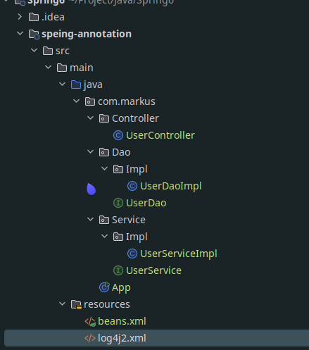
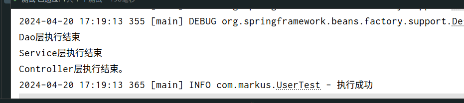

# 基于注解管理`Bean`

从 Java 5 开始，Java 增加了对注解（Annotation）的支持，它是代码中的一种特殊标记，可以在编译、类加载和运行时被读取，执行相应的处理。开发人员可以通过注解在不改变原有代码和逻辑的情况下，在源代码中嵌入补充信息。

Spring 从 2.5 版本开始提供了对注解技术的全面支持，我们可以使用注解来实现自动装配，简化 Spring 的 XML 配置。

Spring 通过注解实现自动装配的步骤如下：

1. 开启组件扫描
2. 使用注解定义 Bean
3. 依赖注入

## 开启组件扫描

Spring 默认不使用注解装配 Bean，因此我们需要在 Spring 的 XML 配置中，通过 <context:component-scan> 元素开启 Spring Beans的自动扫描功能。开启此功能后，Spring 会自动从扫描指定的包（base-package 属性设置）及其子包下的所有类，如果类上使用了 @Component 注解，就将该类装配到容器中。

```xml
<?xml version="1.0" encoding="UTF-8"?>
<beans xmlns="http://www.springframework.org/schema/beans"
       xmlns:xsi="http://www.w3.org/2001/XMLSchema-instance"
       xmlns:context="http://www.springframework.org/schema/context"
       xsi:schemaLocation="http://www.springframework.org/schema/context
           http://www.springframework.org/schema/context/spring-context.xsd
       http://www.springframework.org/schema/beans
       http://www.springframework.org/schema/beans/spring-beans.xsd">
    <context:component-scan base-package="com.markus"></context:component-scan>
</beans>
```

### 最基本的扫描方式

```xml
<context:component-scan base-package="com.markus"></context:component-scan>
```

### 指定要排除的组件

```xml
<context:component-scan base-package="com.markus">
     <!-- context:exclude-filter标签：指定排除规则 -->
    <!-- 
 		type：设置排除或包含的依据
		type="annotation"，根据注解排除，expression中设置要排除的注解的全类名
		type="assignable"，根据类型排除，expression中设置要排除的类型的全类名
	-->
        <context:exclude-filter type="annotation" expression="org.springframework.stereotype.Controller"/>
        <context:exclude-filter type="assignable" expression="com.markus.Controller.UserController"/>
</context:component-scan>
```

### 仅扫描指定组件

```xml
 <context:component-scan base-package="com.markus" use-default-filters="false">
<!--        <context:exclude-filter type="annotation" expression="org.springframework.stereotype.Controller"/>-->
<!--        <context:exclude-filter type="assignable" expression="com.markus.Controller.UserController"/>-->
     <!-- context:include-filter标签：指定在原有扫描规则的基础上追加的规则 -->
    <!-- use-default-filters属性：取值false表示关闭默认扫描规则 -->
    <!-- 此时必须设置use-default-filters="false"，因为默认规则即扫描指定包下所有类 -->
    <!-- 
 		type：设置排除或包含的依据
		type="annotation"，根据注解排除，expression中设置要排除的注解的全类名
		type="assignable"，根据类型排除，expression中设置要排除的类型的全类名
	-->
        <context:include-filter type="annotation" expression="org.springframework.stereotype.Controller"/>
        <context:include-filter type="assignable" expression="com.markus.Controller.UserController"/>
    </context:component-scan>
```

## 使用注解定义`Bean`

`Spring` 提供了以下多个注解，这些注解可以直接标注在 `Java` 类上，将它们定义成 `Spring Bean`。

|     注解      | 说明                                                         |
| :-----------: | :----------------------------------------------------------- |
| `@Component`  | 该注解用于描述 `Spring `中的 `Bean`，它是一个泛化的概念，仅仅表示容器中的一个组件（`Bean`），并且可以作用在应用的任何层次，例如 `Service `层、`Dao` 层等。  使用时只需将该注解标注在相应类上即可。 |
| `@Repository` | 该注解用于将数据访问层（`Dao` 层）的类标识为 `Spring` 中的 `Bean`，其功能与 `@Component` 相同。 |
|  `@Service`   | 该注解通常作用在业务层（`Service `层），用于将业务层的类标识为 `Spring `中的 `Bean`，其功能与 `@Component `相同。 |
| `@Controller` | 该注解通常作用在控制层（如`SpringMVC` 的 `Controller`），用于将控制层的类标识为 `Spring` 中的 `Bean`，其功能与 `@Component` 相同。 |

## `@Autowired`注入

单独使用`@Autowired`注解，**默认根据类型装配**。【默认是`byType`】

```java
//
// Source code recreated from a .class file by IntelliJ IDEA
// (powered by FernFlower decompiler)
//

package org.springframework.beans.factory.annotation;

import java.lang.annotation.Documented;
import java.lang.annotation.ElementType;
import java.lang.annotation.Retention;
import java.lang.annotation.RetentionPolicy;
import java.lang.annotation.Target;

@Target({ElementType.CONSTRUCTOR, ElementType.METHOD, ElementType.PARAMETER, ElementType.FIELD, ElementType.ANNOTATION_TYPE})
@Retention(RetentionPolicy.RUNTIME)
@Documented
public @interface Autowired {
    boolean required() default true;
}
```

- 注解允许存在的位置
  - 构造方法上
  - 方法上
  - 形参上
  - 属性上
  - 注解上

- 该注解有一个required属性，默认值是true，表示在注入的时候要求被注入的Bean必须是存在的，如果不存在则报错。如果required属性设置为false，表示注入的Bean存在或者不存在都没关系，存在的话就注入，不存在的话，也不报错。

### 属性注入



`UserController.class`

```java
package com.markus.Controller;

import com.markus.Service.UserService;
import org.springframework.beans.factory.annotation.Autowired;
import org.springframework.stereotype.Controller;

@Controller
public class UserController {
    @Autowired
    private UserService userService;
    public void out(){
        userService.out();
        System.out.println("Controller层执行结束。");
    }
}
```

`UserDao.class`

```java
package com.markus.Dao;

public interface UserDao {
    void print();
}
```

`UserDaoImpl.class`

```java
package com.markus.Dao.Impl;

import com.markus.Dao.UserDao;
import org.springframework.stereotype.Repository;


@Repository
public class UserDaoImpl implements UserDao {
    @Override
    public void print() {
        System.out.println("Dao层执行结束");
    }
}
```

`UserService.class`

```java
package com.markus.Service;

public interface UserService {
    void out();
}
```

`UserServiceImpl.class`

```java
package com.markus.Service.Impl;

import com.markus.Dao.UserDao;
import com.markus.Service.UserService;
import org.springframework.beans.factory.annotation.Autowired;
import org.springframework.stereotype.Service;

@Service
public class UserServiceImpl implements UserService {
    @Autowired
    private UserDao userDao;
    @Override
    public void out(){
        userDao.print();
        System.out.println("Service层执行结束");
    }
}
```

测试

```java
package com.markus;

import com.markus.Controller.UserController;
import org.junit.jupiter.api.Test;
import org.slf4j.Logger;
import org.slf4j.LoggerFactory;
import org.springframework.context.support.ClassPathXmlApplicationContext;

public class UserTest {
     private Logger logger = LoggerFactory.getLogger(UserTest.class);
    @Test
    public void testUser(){
        ClassPathXmlApplicationContext context = new ClassPathXmlApplicationContext("beans.xml");
        UserController controller = context.getBean("userController", UserController.class);
        controller.out();
        logger.info("执行成功");
    }
}
```

运行结果



### `Setter`注入

