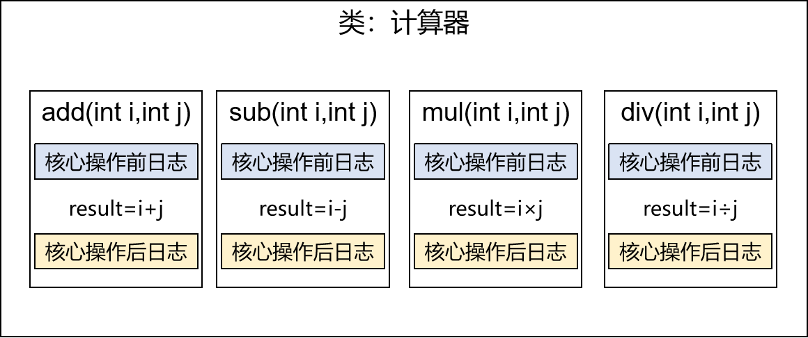
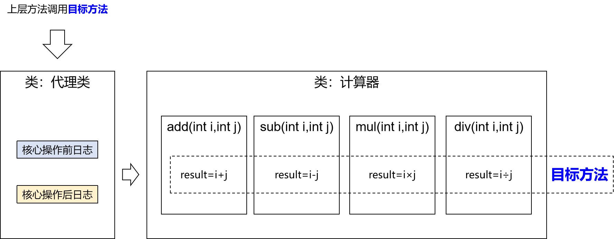
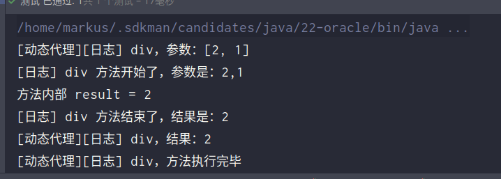

# 面向切面：`AOP`

## 场景模拟

### 声明接口

声明计算器接口Calculator，包含加减乘除的抽象方法

```java
package com.markus.Calculator;

public interface Calculator {
    int add(int i,int j);
    int sub(int i,int j);
    int mul(int i,int j);
    int div(int i,int j);
}
```

### 创建实现类


创建`Calculator.class`的实现类

```java
package com.markus.Calculator.Impl;

import com.markus.Calculator.Calculator;

public class CalculatorImpl implements Calculator {
    @Override
    public int add(int i, int j) {
        int result = 1+j;
        System.out.println("方法内部 result = " + result);
        return result;
    }

    @Override
    public int sub(int i, int j) {
        int result = i-j;
        System.out.println("方法内部 result = " + result);
        return result;
    }

    @Override
    public int mul(int i, int j) {
        int result = i*j;
        System.out.println("方法内部 result = " + result);
        return result;
    }

    @Override
    public int div(int i, int j) {
        if (j != 0) {
            int result = i/j;
            System.out.println("方法内部 result = " + result);
            return result;
        }
        else {
            throw new RuntimeException("除数不能为0");
        }
    }
}
```

### 创建带日志功能的实现类



```java
package com.markus.Calculator.Impl;

import com.markus.Calculator.Calculator;

public class CalculatorImpl implements Calculator {
    @Override
    public int add(int i, int j) {
        System.out.println("[日志] add 方法开始了，参数是：" + i + "," + j);
        int result = 1+j;
        System.out.println("方法内部 result = " + result);
        System.out.println("[日志] add 方法结束了，结果是：" + result);
        return result;
    }

    @Override
    public int sub(int i, int j) {
        System.out.println("[日志] sub 方法开始了，参数是：" + i + "," + j);
        int result = i-j;
        System.out.println("方法内部 result = " + result);
        System.out.println("[日志] sub 方法结束了，结果是：" + result);
        return result;
    }

    @Override
    public int mul(int i, int j) {
        System.out.println("[日志] mul 方法开始了，参数是：" + i + "," + j);
        int result = i*j;
        System.out.println("方法内部 result = " + result);
        System.out.println("[日志] mul 方法结束了，结果是：" + result);
        return result;
    }

    @Override
    public int div(int i, int j) {
        if (j != 0) {
            System.out.println("[日志] div 方法开始了，参数是：" + i + "," + j);
            int result = i/j;
            System.out.println("方法内部 result = " + result);
            System.out.println("[日志] div 方法结束了，结果是：" + result);
            return result;
        }
        else {
            throw new RuntimeException("除数不能为0");
        }
    }
}
```

###  提出问题

**①现有代码缺陷**

针对带日志功能的实现类，我们发现有如下缺陷：

- 对核心业务功能有干扰，导致程序员在开发核心业务功能时分散了精力
- 附加功能分散在各个业务功能方法中，不利于统一维护

**②解决思路**

解决这两个问题，核心就是：解耦。我们需要把附加功能从业务功能代码中抽取出来。

**③困难**

解决问题的困难：要抽取的代码在方法内部，靠以前把子类中的重复代码抽取到父类的方式没法解决。所以需要引入新的技术。

## 代理模式

### 概念

#### 介绍

二十三种设计模式中的一种，属于结构型模式。它的作用就是通过提供一个代理类，让我们在调用目标方法的时候，不再是直接对目标方法进行调用，而是通过代理类**间接**调用。让不属于目标方法核心逻辑的代码从目标方法中剥离出来——**解耦**。调用目标方法时先调用代理对象的方法，减少对目标方法的调用和打扰，同时让附加功能能够集中在一起也有利于统一维护。


使用代理后


#### 生活中的代理

- 广告商找大明星拍广告需要经过经纪人
- 合作伙伴找大老板谈合作要约见面时间需要经过秘书
- 房产中介是买卖双方的代理

#### 相关术语

- 代理：将非核心逻辑剥离出来以后，封装这些非核心逻辑的类、对象、方法。
- 目标：被代理“套用”了非核心逻辑代码的类、对象、方法。

### 静态代理

创建静态代理类：

```java
package com.markus.Calculator.Proxy;

import com.markus.Calculator.Calculator;

public class CalculatorProxy implements Calculator {
    private Calculator target;
    public CalculatorProxy(Calculator target){
        this.target=target;
    }

    @Override
    public int add(int i, int j) {
        System.out.println("[日志] add 方法开始了，参数是：" + i + "," + j);
        int addResult = target.add(i,j);
        System.out.println("[日志] add 方法结束了，结果是：" + addResult);
        return addResult;
    }

    @Override
    public int sub(int i, int j) {
        System.out.println("[日志] sub 方法开始了，参数是：" + i + "," + j);
        int subResult = target.sub(i,j);
        System.out.println("[日志] sub 方法结束了，结果是：" + subResult);
        return subResult;
    }

    @Override
    public int mul(int i, int j) {
        System.out.println("[日志] mul 方法开始了，参数是：" + i + "," + j);
        int mulResult = target.mul(i,j);
        System.out.println("[日志] mul 方法结束了，结果是：" + mulResult);
        return mulResult;
    }

    @Override
    public int div(int i, int j) {
        System.out.println("[日志] div 方法开始了，参数是：" + i + "," + j);
        if(j == 0){
            System.out.println("[日志] div 方法结束了，结果是：" + 0);
            return 0;
        }
        int divResult = target.div(i,j);
        System.out.println("[日志] div 方法结束了，结果是：" + divResult);
        return divResult;
    }
}
```

静态代理确实实现了解耦，但是由于代码都写死了，完全不具备任何的灵活性。就拿日志功能来说，将来其他地方也需要附加日志，那还得再声明更多个静态代理类，那就产生了大量重复的代码，日志功能还是分散的，没有统一管理。

提出进一步的需求：将日志功能集中到一个代理类中，将来有任何日志需求，都通过这一个代理类来实现。这就需要使用动态代理技术了。

### 动态代理



生产代理对象的工厂类：

```java
package com.markus.Calculator.Proxy;

import java.lang.reflect.InvocationHandler;
import java.lang.reflect.Method;
import java.lang.reflect.Proxy;
import java.util.Arrays;

public class  ProxyFactory{
    private Object target;
    public ProxyFactory(Object target){
        this.target = target;
    }
    /**
     * newProxyInstance()：创建一个代理实例
     * 其中有三个参数：
     * 1、classLoader：加载动态生成的代理类的类加载器
     * 2、interfaces：目标对象实现的所有接口的class对象所组成的数组
     * 3、invocationHandler：设置代理对象实现目标对象方法的过程，即代理类中如何重写接口中的抽象方法
     */
    public Object getProxy(){
       ClassLoader classLoader = target.getClass().getClassLoader();
       Class<?>[] interfaces = target.getClass().getInterfaces();
        /**
         * proxy：代理对象
         * method：代理对象需要实现的方法，即其中需要重写的方法
         * args：method所对应方法的参数
         */
        InvocationHandler invocationHandler = new InvocationHandler() {
            @Override
            public Object invoke(Object proxy, Method method, Object[] args) throws Throwable {
                Object result = null;
                try {
                    System.out.println("[动态代理][日志] "+method.getName()+"，参数："+ Arrays.toString(args));
                    result = method.invoke(target,args);
                    System.out.println("[动态代理][日志] "+method.getName()+"，结果："+ result);
                }
                catch (Exception e){
                    e.printStackTrace();
                    System.out.println("[动态代理][日志] "+method.getName()+"，异常："+e.getMessage());
                }finally {
                    System.out.println("[动态代理][日志] "+method.getName()+"，方法执行完毕");
                }
            return result;
            }
        };
    return Proxy.newProxyInstance(classLoader,interfaces,invocationHandler);
    }
}
```

### 测试

```java
package com.markus;

import com.markus.Calculator.Calculator;
import com.markus.Calculator.Impl.CalculatorImpl;
import com.markus.Calculator.Proxy.ProxyFactory;
import org.junit.jupiter.api.Test;

public class ProxyFactoryTest {
    @Test
    public void testProxyFactory(){
        ProxyFactory proxyFactory = new ProxyFactory(new CalculatorImpl());
        Calculator proxy = (Calculator) proxyFactory.getProxy();
        proxy.div(2,1);
    }
}
```

