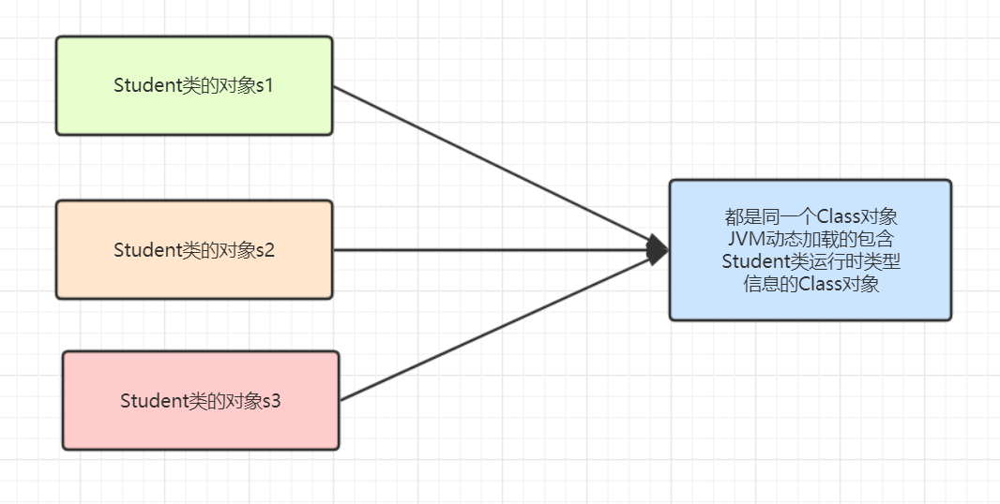
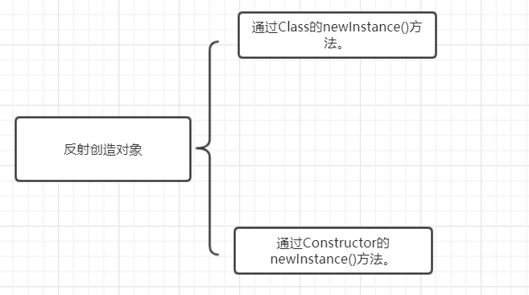
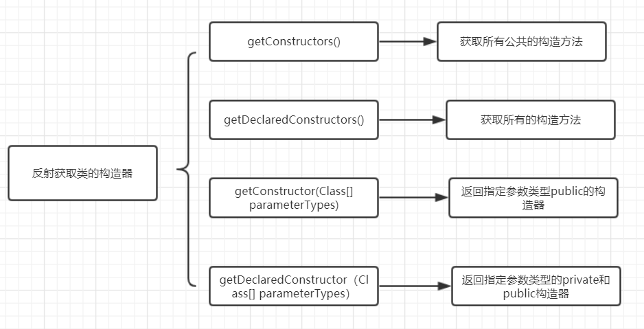
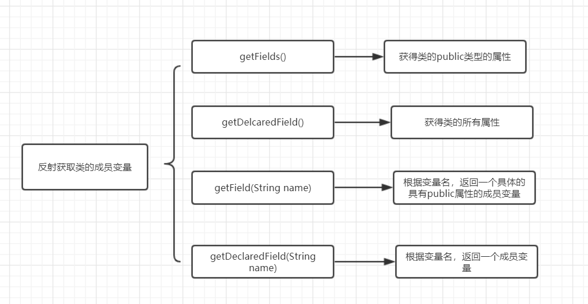
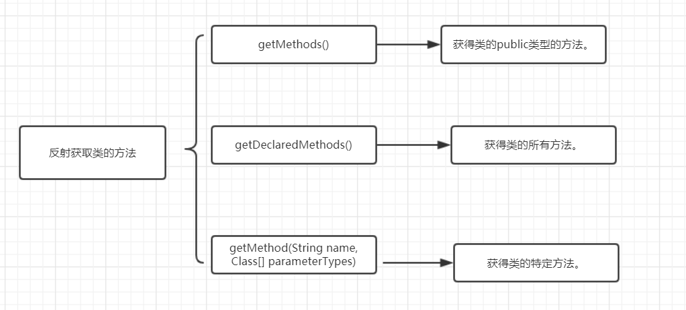
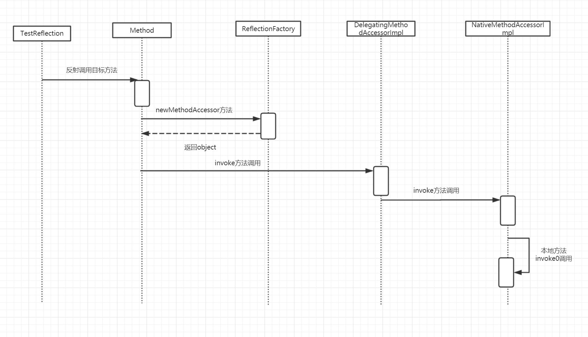

# `Java`反射

## 前言

反射是Java底层框架的灵魂技术，学习反射非常有必要，本文将从入门概念，到实践，再到原理讲解反射，希望对大家有帮助。

## 反射理解

### 官方解释

`Java` 的**反射机制**是指在运行状态中，对于任意一个类都能够知道这个类所有的属性和方法； 并且对于任意一个对象，都能够调用它的任意一个方法；这种动态获取信息以及动态调用对象方法的功能成为`Java`语言的反射机制。

### 白话理解

#### 正射

万物有阴必有阳，有正必有反。既然有反射，就必有“正射”。

那么**正射**是什么呢？

我们在编写代码时，当需要使用到某一个类的时候，都会先了解这个类是做什么的。然后实例化这个类，接着用实例化好的对象进行操作，这就是正射。

```java
Student student = new Student();
student.doHomeWork("数学");
```

#### 反射

反射就是，一开始并不知道我们要初始化的类对象是什么，自然也无法使用 new 关键字来创建对象了。

```java
Class clazz = Class.forName("packagePath.Student");
Method method = clazz.getMethod("doHomework",String.class);
Constructor constructor = clazz.getConstructor();
Object object = constructor.newInstance();
method.invoke(object,"语文");
```

测试代码

```java
package com.markus;

import com.markus.Reflection.Student;
import org.junit.jupiter.api.Test;

import java.lang.reflect.Constructor;
import java.lang.reflect.Method;

public class ReflectionTest {
    @Test
    public void testReflection() throws Exception{
        Class clazz = Class.forName("com.markus.Reflection.Student");
        Method method = clazz.getMethod("doHomeWork", String.class);
        Constructor constructor = clazz.getConstructor();
        Object object = constructor.newInstance();
        method.invoke(object,"java");
        
        Student student = new Student();
        student.doHomeWork("java");
    }
}
```

执行结果一样，但是也略有不同

- 第一段代码则是到整个程序运行的时候，从字符串`reflection.Student`，才知道要操作的类是`Student`

- 第二段代码在未运行前就已经知道了要运行的类是`Student`；

**结论**

反射就是在运行时才知道要操作的类是什么，并且可以在运行时获取类的完整构造，并调用对应的方法。

### `Class`对象理解

要理解Class对象，我们先来了解一下**`RTTI`**吧。 **`RTTI`（`Run-Time Type Identification`）运行时类型识别**，其作用是在运行时识别一个对象的类型和类的信息。

Java是如何让我们在运行时识别对象和类的信息的？主要有两种方式： 一种是传统的**`RRTI`**，它假定我们在编译期已知道了所有类型。 另一种是反射机制，它允许我们在运行时发现和使用类的信息。

**每个类都有一个`Class`对象**，每当编译一个新类就产生一个Class对象（更恰当地说，是被保存在一个同名的`.class`文件中）。比如创建一个`Student`类，那么，`JVM`就会创建一个`Student`对应`Class`类的`Class`对象，该`Class`对象保存了`Student`类相关的类型信息。



**Class类的对象作用**是运行时提供或获得某个对象的类型信息

### 反射的基本使用

#### 获取`Class`类对象

获取反射中的Class对象有三种方法。

- `Class.forName("packagePath.className")静态方法`

  ```java
  Class clazz = Class.forName("com.markus.Reflection.Student");
  ```
  
- 使用类的`.class `方法

  ```java
  Class clazz = Student.class
  ```
  
- 使用实例对象的 `getClass() `方法

  ```java
  Student student = new Student();
  Class clazz = student.getClass();
  ```

#### 反射创造对象，获取方法，成员变量，构造器

##### 反射创造对象

通过反射创建类对象主要有两种方式：



```java
//方法一
Class clazz = Class.forName("com.markus.Reflection.Student");
Student student = clazz.newInstance();
//方法二
Constructor constructor = clazz.getConstructor();
Student student =(Student)constructor.newInstance();
```

##### 反射获取类的构造器



```java
Class clazz = Class.forName("com.markus.Reflection.Student");
Constructor[] constructors = clazz.getDeclaredConstructors();
for(int i=0;i<constructors.length;++i){
    System.out.println(constructors[i]);
}
```

##### 反射获取类的成员变量



```java
public class Student{
    public String name;
    private Integer id;
}

public class StudentTest{
    @Test
    public void testStudent(){
        Class clazz = Class.forName("com.markus.Reflection.Student");
        Field field1=clazz.getField("name");
        Field field2=clazz.getDeclaredField("id");
    }
}
```

##### 反射获取类的方法



```java
public class Student{
    public void doHomework(String classKind){
        System.out.printf("学生正在做%s作业"，classKind);
    }
    private void pushHomework(String classKind){
        System.out.printf("学生提交了%s作业"，classKind);
    }
}
public StudentTest{
    @Test
    public void testStudent(){
        Class clazz = Class.forName("com.markus.Reflection.Student");
        Method[] methods = clazz.getDeclaredMethods();
        for(Method method : methods){
           System.out.println( method.getName());
        }
        Method method = clazz.getMethod("doHomework",String.class);
    }
}
```

#### `Method`的`invoke()方法`



```java
package com.markus.Calculator.Proxy;

import java.lang.reflect.InvocationHandler;
import java.lang.reflect.Method;
import java.lang.reflect.Proxy;
import java.util.Arrays;

public class  ProxyFactory{
    private Object target;
    public ProxyFactory(Object target){
        this.target = target;
    }
    /**
     * newProxyInstance()：创建一个代理实例
     * 其中有三个参数：
     * 1、classLoader：加载动态生成的代理类的类加载器
     * 2、interfaces：目标对象实现的所有接口的class对象所组成的数组
     * 3、invocationHandler：设置代理对象实现目标对象方法的过程，即代理类中如何重写接口中的抽象方法
     */
    public Object getProxy(){
       ClassLoader classLoader = target.getClass().getClassLoader();
       Class<?>[] interfaces = target.getClass().getInterfaces();
        /**
         * proxy：代理对象
         * method：代理对象需要实现的方法，即其中需要重写的方法
         * args：method所对应方法的参数
         */
        InvocationHandler invocationHandler = new InvocationHandler() {
            @Override
            public Object invoke(Object proxy, Method method, Object[] args) throws Throwable {
                Object result = null;
                try {
                    System.out.println("[动态代理][日志] "+method.getName()+"，参数："+ Arrays.toString(args));
                    result = method.invoke(target,args);
                    System.out.println("[动态代理][日志] "+method.getName()+"，结果："+ result);
                }
                catch (Exception e){
                    e.printStackTrace();
                    System.out.println("[动态代理][日志] "+method.getName()+"，异常："+e.getMessage());
                }finally {
                    System.out.println("[动态代理][日志] "+method.getName()+"，方法执行完毕");
                }
            return result;
            }
        };
    return Proxy.newProxyInstance(classLoader,interfaces,invocationHandler);
    }
}
package com.markus;

import com.markus.Reflection.Student;
import org.junit.jupiter.api.Test;

import java.lang.reflect.Constructor;
import java.lang.reflect.Method;

public class ReflectionTest {
    @Test
    public void testReflection() throws Exception{
        Class clazz = Class.forName("com.markus.Reflection.Student");
        Method method = clazz.getMethod("doHomeWork", String.class);
        Constructor constructor = clazz.getConstructor();
        Object object = constructor.newInstance();
        method.invoke(object,"java");
        Student student = new Student();
        student.doHomeWork("CiaoMing","java");
    }
}
```

