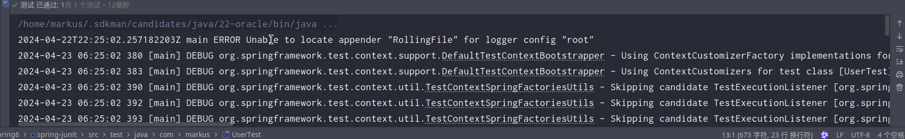

# 单元测试：JUnit

在之前的测试方法中，几乎都能看到以下的两行代码：

```java
ApplicationContext context = new ClassPathXmlApplicationContext("xxx.xml");
Xxxx xxx = context.getBean(Xxxx.class);
```

这两行代码的作用是创建Spring容器，最终获取到对象，但是每次测试都需要重复编写。针对上述问题，我们需要的是程序能自动帮我们创建容器。我们都知道JUnit无法知晓我们是否使用了 Spring 框架，更不用说帮我们创建 Spring 容器了。Spring提供了一个运行器，可以读取配置文件（或注解）来创建容器。我们只需要告诉它配置文件位置就可以了。这样一来，我们通过Spring整合JUnit可以使程序创建spring容器了

## 整合JUnit5

### 引入依赖

```xml
<project xmlns="http://maven.apache.org/POM/4.0.0" xmlns:xsi="http://www.w3.org/2001/XMLSchema-instance"
         xsi:schemaLocation="http://maven.apache.org/POM/4.0.0 http://maven.apache.org/xsd/maven-4.0.0.xsd">
    <modelVersion>4.0.0</modelVersion>
    <parent>
        <groupId>com.markus</groupId>
        <artifactId>Spring6</artifactId>
        <version>1.0-SNAPSHOT</version>
    </parent>

    <artifactId>spring-junit</artifactId>
    <packaging>jar</packaging>

    <name>spring-junit</name>
    <url>http://maven.apache.org</url>

    <properties>
        <project.build.sourceEncoding>UTF-8</project.build.sourceEncoding>
    </properties>

    <dependencies>
        <dependency>
            <groupId>junit</groupId>
            <artifactId>junit</artifactId>
            <version>3.8.1</version>
            <scope>test</scope>
        </dependency>
        <dependency>
            <groupId>org.springframework</groupId>
            <artifactId>spring-context</artifactId>
            <version>6.1.6</version>
        </dependency>
        <dependency>
            <groupId>org.springframework</groupId>
            <artifactId>spring-test</artifactId>
            <version>6.1.6</version>
        </dependency>
        <dependency>
            <groupId>org.apache.logging.log4j</groupId>
            <artifactId>log4j-core</artifactId>
            <version>2.23.1</version>
        </dependency>
        <dependency>
            <groupId>org.apache.logging.log4j</groupId>
            <artifactId>log4j-slf4j2-impl</artifactId>
            <version>2.23.1</version>
        </dependency>
        <dependency>
            <groupId>org.junit.jupiter</groupId>
            <artifactId>junit-jupiter-api</artifactId>
            <version>5.10.2</version>
            <scope>test</scope>
        </dependency>
    </dependencies>
</project>
```

### 添加配置文件

```xml
<?xml version="1.0" encoding="UTF-8"?>
<beans xmlns="http://www.springframework.org/schema/beans"
       xmlns:xsi="http://www.w3.org/2001/XMLSchema-instance"
       xmlns:context="http://www.springframework.org/schema/context"
       xsi:schemaLocation="http://www.springframework.org/schema/beans
        http://www.springframework.org/schema/beans/spring-beans.xsd
        http://www.springframework.org/schema/context
        http://www.springframework.org/schema/context/spring-context.xsd">
    <context:component-scan base-package="com.markus"/>
</beans>
```

### 添加`Java`类

```java
package com.markus.beans;

import org.springframework.stereotype.Component;

@Component
public class User {
    public User(){
        System.out.println("User constructor");;
    }
}
```

### 全注解开发

#### 添加`Config`类

```java
package com.markus.Config;

import org.springframework.context.annotation.ComponentScan;
import org.springframework.context.annotation.Configuration;

@Configuration
@ComponentScan(basePackages = "com.markus.beans")
public class MyConfig {
}
```

### 基于`XML`测试

```java
package com.markus;

import com.markus.beans.User;
import org.junit.jupiter.api.Test;
import org.springframework.beans.factory.annotation.Autowired;
import org.springframework.test.context.junit.jupiter.SpringJUnitConfig;

//@ExtendWith(SpringExtension.class)
//@ContextConfiguration("classpath:beans.xml")
@SpringJUnitConfig(locations = "classpath:beans.xml")
public class UserTest {
    @Autowired
    private User user;
    @Test
    public void test(){
        System.out.println(user);
    }
}

```

### 全注解测试

```java
package com.markus;

import com.markus.Config.MyConfig;
import com.markus.beans.User;
import org.junit.jupiter.api.Test;
import org.springframework.beans.factory.annotation.Autowired;
import org.springframework.test.context.junit.jupiter.SpringJUnitConfig;

//@ExtendWith(SpringExtension.class)
//@ContextConfiguration("classpath:beans.xml")
//@SpringJUnitConfig(locations = "classpath:beans.xml")

//@ExtendWith(SpringExtension.class)
//@ContextConfiguration(classes = {MyConfig.class})
@SpringJUnitConfig(classes = {MyConfig.class})
public class UserTest {
    @Autowired
    private User user;
    @Test
    public void test(){
        System.out.println(user);
    }
}
```

测试通过


