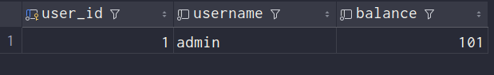
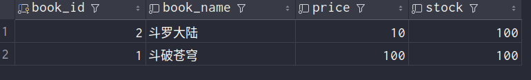
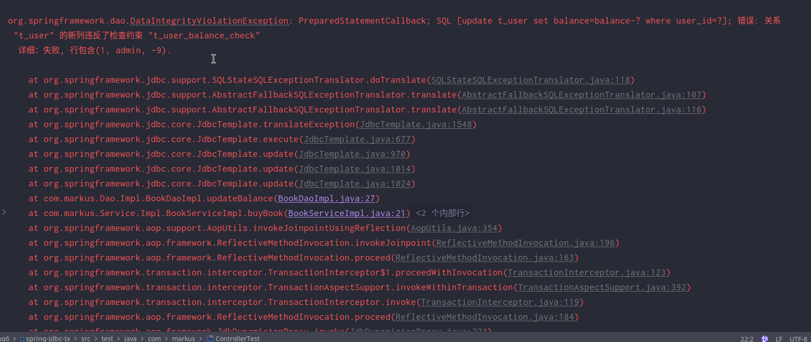

# 事务

## `JdbcTemplate`

#### 

### 简介


### 准备工作

#### 引入依赖

```xml
<project xmlns="http://maven.apache.org/POM/4.0.0" xmlns:xsi="http://www.w3.org/2001/XMLSchema-instance"
         xsi:schemaLocation="http://maven.apache.org/POM/4.0.0 http://maven.apache.org/xsd/maven-4.0.0.xsd">
    <modelVersion>4.0.0</modelVersion>
    <parent>
        <groupId>com.markus</groupId>
        <artifactId>Spring6</artifactId>
        <version>1.0-SNAPSHOT</version>
    </parent>

    <artifactId>spring-jdbc-tx</artifactId>
    <packaging>jar</packaging>

    <name>spring-jdbc-tx</name>
    <url>http://maven.apache.org</url>

    <properties>
        <project.build.sourceEncoding>UTF-8</project.build.sourceEncoding>
    </properties>

    <dependencies>
        <dependency>
            <groupId>junit</groupId>
            <artifactId>junit</artifactId>
            <version>3.8.1</version>
            <scope>test</scope>
        </dependency>
        <dependency>
            <groupId>org.springframework</groupId>
            <artifactId>spring-jdbc</artifactId>
            <version>6.1.6</version>
        </dependency>
        <dependency>
            <groupId>org.postgresql</groupId>
            <artifactId>postgresql</artifactId>
            <version>42.7.3</version>
        </dependency>
        <dependency>
            <groupId>com.alibaba</groupId>
            <artifactId>druid</artifactId>
            <version>1.2.22</version>
        </dependency>
        <dependency>
            <groupId>org.springframework</groupId>
            <artifactId>spring-context</artifactId>
            <version>6.1.6</version>
        </dependency>
        <dependency>
            <groupId>org.junit.jupiter</groupId>
            <artifactId>junit-jupiter-api</artifactId>
            <version>5.10.2</version>
            <scope>test</scope>
        </dependency>
        <dependency>
            <groupId>org.springframework</groupId>
            <artifactId>spring-test</artifactId>
            <version>6.1.6</version>
        </dependency>
        <dependency>
            <groupId>org.apache.logging.log4j</groupId>
            <artifactId>log4j-core</artifactId>
            <version>2.23.1</version>
        </dependency>
        <dependency>
            <groupId>org.apache.logging.log4j</groupId>
            <artifactId>log4j-slf4j2-impl</artifactId>
            <version>2.23.1</version>
        </dependency>
    </dependencies>
</project>
```

#### 创建`jdbc.properties`

```properties
jdbc.user=markus
jdbc.password=123456
jdbc.url=jdbc:postgresql://localhost:5432/markus
jdbc.driver=org.postgresql.Driver
```

#### 配置`Spring`的配置文件

```xml
<?xml version="1.0" encoding="UTF-8"?>
<beans xmlns="http://www.springframework.org/schema/beans"
       xmlns:xsi="http://www.w3.org/2001/XMLSchema-instance"
       xmlns:context="http://www.springframework.org/schema/context"
       xsi:schemaLocation="http://www.springframework.org/schema/context
       http://www.springframework.org/schema/context/spring-context.xsd
       http://www.springframework.org/schema/beans
       http://www.springframework.org/schema/beans/spring-beans.xsd">
    <!--引入外部属性文件-->
    <context:property-placeholder location="classpath:jdbc.properties"/>
    <!--配置数据源-->
    <bean id="druidDataSource" class="com.alibaba.druid.pool.DruidDataSource">
        <property name="url" value="${jdbc.url}"/>
        <property name="username" value="${jdbc.user}"/>
        <property name="password" value="${jdbc.password}"/>
        <property name="driverClassName" value="${jdbc.driver}"/>
    </bean>
    <!--配置JDBCTemplate-->
    <bean id="jdbcTemplate" class="org.springframework.jdbc.core.JdbcTemplate">
        <!--装配数据源-->
        <property name="dataSource" ref="druidDataSource"/>
    </bean>
</beans>
```

#### 准备数据库与数据表

```sql
create table "user"(
    id serial not null ,
    name varchar(20) DEFAULT NULL,
    age smallint DEFAULT NULL check ( age>0 and age<100),
    sex varchar(2) DEFAULT NULL,
    PRIMARY KEY (id)
);
COMMENT ON COLUMN "user".name IS '姓名';
COMMENT ON COLUMN "user".age IS '年龄';
COMMENT ON COLUMN "user".sex IS '性别';
```

#### 实现`CRUD`

##### 装配`JDBCTemplate`

集成`Junit`和日志功能

```java
package com.markus;

import org.junit.jupiter.api.Test;
import org.springframework.beans.factory.annotation.Autowired;
import org.springframework.jdbc.core.JdbcTemplate;
import org.springframework.test.context.junit.jupiter.SpringJUnitConfig;

@SpringJUnitConfig(locations = "classpath:beans.xml")
public class JDBCTest {
    @Autowired
    private JdbcTemplate jdbcTemplate;
}
```

##### 测试增删改功能

```java
@Test
    public void testUpdate(){
//        String sql = "insert into \"user\" (name,age,sex) values(?,?,?)";
//        jdbcTemplate.update(sql,"markus",18,"男");

//          String sql ="update \"user\" set name=? where id=?";
//          jdbcTemplate.update(sql,"张三",1);

        String sql="delete from \"user\" where id=?";
        jdbcTemplate.update(sql,1);
    }
```

##### 查询数据返回对象

```java
    @Test
    public void testSelectObject(){
        String sql = "select * from \"user\" where id=?";
//        Emp empResult = jdbcTemplate.queryForObject(sql,(rs,rowNum)->{
//            Emp emp = new Emp();
//            emp.setId(rs.getInt("id"));
//            emp.setName(rs.getString("name"));
//            emp.setAge(rs.getInt("age"));
//            emp.setSex(rs.getString("sex"));
//            return emp;
//        },1);
        Emp empResult = jdbcTemplate.queryForObject(sql,new BeanPropertyRowMapper<>(Emp.class),1);
        System.out.println(empResult);
    }
```

##### 查询数据返回list集合

```java
 @Test
    public void testSelectList(){
        String sql = "select * from \"user\"";
        List<Emp> Result = jdbcTemplate.query(sql,new BeanPropertyRowMapper<>(Emp.class));
        System.out.println(Result);
    }
```

##### 查询返回单个的值

```java
@Test
public void testSelectCount(){
    String sql = "select count(*) from \"user\"";
    Integer count = jdbcTemplate.queryForObject(sql,Integer.class);
    System.out.println(count);
}
```

## 声明式事务概念

### 事务基本概念

#### 什么是事务

数据库事务( `transaction`)是访问并可能操作各种数据项的一个数据库操作序列，这些操作要么全部执行,要么全部不执行，是一个不可分割的工作单位。事务由事务开始与事务结束之间执行的全部数据库操作组成。

#### 事务的特性

**A：原子性(Atomicity)**

一个事务(transaction)中的所有操作，要么全部完成，要么全部不完成，不会结束在中间某个环节。事务在执行过程中发生错误，会被回滚（Rollback）到事务开始前的状态，就像这个事务从来没有执行过一样。

**C：一致性(Consistency)**

事务的一致性指的是在一个事务执行之前和执行之后数据库都必须处于一致性状态。

如果事务成功地完成，那么系统中所有变化将正确地应用，系统处于有效状态。

如果在事务中出现错误，那么系统中的所有变化将自动地回滚，系统返回到原始状态。

**I：隔离性(Isolation)**

指的是在并发环境中，当不同的事务同时操纵相同的数据时，每个事务都有各自的完整数据空间。由并发事务所做的修改必须与任何其他并发事务所做的修改隔离。事务查看数据更新时，数据所处的状态要么是另一事务修改它之前的状态，要么是另一事务修改它之后的状态，事务不会查看到中间状态的数据。

**D：持久性(Durability)**

指的是只要事务成功结束，它对数据库所做的更新就必须保存下来。即使发生系统崩溃，重新启动数据库系统后，数据库还能恢复到事务成功结束时的状态。

### 编程式事务

事务功能的相关操作全部通过自己编写代码来实现：

```java
Connection conn = ...;
    
try {
    
    // 开启事务：关闭事务的自动提交
    conn.setAutoCommit(false);
    
    // 核心操作
    
    // 提交事务
    conn.commit();
    
}catch(Exception e){
    
    // 回滚事务
    conn.rollBack();
    
}finally{
    
    // 释放数据库连接
    conn.close();
    
}
```

编程式的实现方式存在缺陷：

- 细节没有被屏蔽：具体操作过程中，所有细节都需要程序员自己来完成，比较繁琐。
- 代码复用性不高：如果没有有效抽取出来，每次实现功能都需要自己编写代码，代码就没有得到复用。

### 声明式事务

既然事务控制的代码有规律可循，代码的结构基本是确定的，所以框架就可以将固定模式的代码抽取出来，进行相关的封装。

封装起来后，我们只需要在配置文件中进行简单的配置即可完成操作。

- 好处1：提高开发效率
- 好处2：消除了冗余的代码
- 好处3：框架会综合考虑相关领域中在实际开发环境下有可能遇到的各种问题，进行了健壮性、性能等各个方面的优化

所以，我们可以总结下面两个概念：

- **编程式**：**自己写代码**实现功能
- **声明式**：通过**配置**让**框架**实现功能

## 基于注解的声明式事务

### 准备工作

#### 添加`Spring`配置

```xml
<context:component-scan base-package="com.markus"/>
```

#### 创建表

```sql
CREATE TABLE t_book (
                        book_id SERIAL PRIMARY KEY,
                        book_name varchar(20) NOT NULL DEFAULT NULL,
                        price integer NOT NULL DEFAULT NULL,
                        stock integer NOT NULL DEFAULT NULL CHECK (stock >= 0)
);

COMMENT ON TABLE t_book IS '图书信息表';
COMMENT ON COLUMN t_book.book_id IS '主键';
COMMENT ON COLUMN t_book.book_name IS '图书名称';
COMMENT ON COLUMN t_book.price IS '价格';
COMMENT ON COLUMN t_book.stock IS '库存（无符号）';

INSERT INTO t_book (book_id, book_name, price, stock) VALUES
                                                          (1, '斗破苍穹', 80, 100),
                                                          (2, '斗罗大陆', 50, 100);

CREATE TABLE t_user (
                        user_id SERIAL PRIMARY KEY,
                        username varchar(20) NOT NULL DEFAULT NULL,
                        balance integer NOT NULL DEFAULT NULL CHECK (balance >= 0)
);
COMMENT ON TABLE t_user IS '用户信息表';
COMMENT ON COLUMN t_user.user_id IS '主键';
COMMENT ON COLUMN t_user.username IS '用户名';
COMMENT ON COLUMN t_user.balance IS '余额（无符号）';

INSERT INTO t_user (user_id, username, balance) VALUES
    (1, 'admin', 50);
```

#### 创建组件

创建`BookController`

```java
package com.markus.Controller;

import com.markus.Service.BookService;
import org.springframework.beans.factory.annotation.Autowired;
import org.springframework.stereotype.Controller;

@Controller
public class BookController {
    @Autowired
private BookService bookService;
    public void buyBook(Integer bookId, Integer userId)
    {
        bookService.buyBook(bookId,userId);
    }
}
```

创建接口`BookService`

```java
package com.markus.Service;

public interface BookService {
    void buyBook(Integer bookId, Integer userId);
}
```

创建实现类`BookServiceImpl`

```java
package com.markus.Service.Impl;

import com.markus.Dao.BookDao;
import com.markus.Service.BookService;
import org.springframework.beans.factory.annotation.Autowired;
import org.springframework.stereotype.Service;

@Service
public class BookServiceImpl implements BookService {
    @Autowired
    private BookDao bookDao;
    @Override
    public void buyBook(Integer bookId, Integer userId) {
        Integer price =bookDao.getPriceByBookId(bookId);
        bookDao.updateStock(bookId);
        bookDao.updateBalance(userId,price);
    }
}
```

创建接口`BookDao`

```java
package com.markus.Dao;

public interface BookDao {
    Integer getPriceByBookId(Integer bookId);

    void updateStock(Integer bookId);

    void updateBalance(Integer userId, Integer price);
}
```

创建实现类`BookDaoImpl`

```java
package com.markus.Dao.Impl;

import com.markus.Dao.BookDao;
import org.springframework.beans.factory.annotation.Autowired;
import org.springframework.jdbc.core.JdbcTemplate;
import org.springframework.stereotype.Repository;

@Repository
public class BookDaoImpl implements BookDao {
    @Autowired
    private JdbcTemplate jdbcTemplate;
    @Override
    public Integer getPriceByBookId(Integer bookId) {
        String sql = "select price from \"t_book\" where book_id=?";
        return jdbcTemplate.queryForObject(sql,Integer.class,bookId);
    }

    @Override
    public void updateStock(Integer bookId) {
        String sql = "update \"t_book\" set stock=stock-1 where book_id=?";
        jdbcTemplate.update(sql,bookId);
    }

    @Override
    public void updateBalance(Integer userId, Integer price) {
        String sql ="update t_user set balance=balance-? where user_id=?";
        jdbcTemplate.update(sql,price,userId);
    }
}
```

### 测试无事务情况

#### 创建测试类

```java
package com.markus.Controller;

import com.markus.Service.BookService;
import org.springframework.beans.factory.annotation.Autowired;
import org.springframework.stereotype.Controller;

@Controller
public class BookController {
    @Autowired
private BookService bookService;
    public void buyBook(Integer bookId, Integer userId)
    {
        bookService.buyBook(bookId,userId);
    }
}
```

#### 模拟场景

用户购买图书，先查询图书的价格，再更新图书的库存和用户的余额

假设用户id为1的用户，购买id为1的图书

用户余额为50，而图书价格为80

购买图书之后，用户的余额为-30，数据库中余额字段设置了无符号，因此无法将-30插入到余额字段

此时执行`sql`语句会抛出`SQLException`

#### 观察结果

因为没有添加事务，图书的库存更新了，但是用户的余额没有更新

显然这样的结果是错误的，购买图书是一个完整的功能，更新库存和更新余额要么都成功要么都失败

### 加入事务

#### 添加事务配置

##### 在spring配置文件中引入`tx`命名空间

```xml
<?xml version="1.0" encoding="UTF-8"?>
<beans xmlns="http://www.springframework.org/schema/beans"
       xmlns:xsi="http://www.w3.org/2001/XMLSchema-instance"
       xmlns:context="http://www.springframework.org/schema/context"
       xmlns:tx="http://www.springframework.org/schema/tx"
       xsi:schemaLocation="http://www.springframework.org/schema/beans
       http://www.springframework.org/schema/beans/spring-beans.xsd
       http://www.springframework.org/schema/context
       http://www.springframework.org/schema/context/spring-context.xsd
       http://www.springframework.org/schema/tx
       http://www.springframework.org/schema/tx/spring-tx.xsd">
```

##### 在Spring的配置文件中添加配置

```xml
<bean id="transactionManager" class="org.springframework.jdbc.datasource.DataSourceTransactionManager">
        <property name="dataSource" ref="druidDataSource"/>
</bean>
<!--
    开启事务的注解驱动
    通过注解@Transactional所标识的方法或标识的类中所有的方法，都会被事务管理器管理事务
-->
<!-- transaction-manager属性的默认值是transactionManager，如果事务管理器bean的id正好就是这个默认值，则可以省略这个属性 -->
<tx:annotation-driven transaction-manager="transactionManager"/>
```

##### 添加事务注解

因为service层表示业务逻辑层，一个方法表示一个完成的功能，因此处理事务一般在service层处理

**在`BookServiceImpl`的`buybook()`添加注解`@Transactional`**

##### 测试结果

虽然测试失败，但是数据也没有更新

### `@Transactional`注解标识的位置

`@Transactional`标识在方法上，则只会影响该方法

`@Transactional`标识的类上，则会影响类中所有的方法

### 事务属性：只读

#### 介绍

对一个查询操作来说，如果我们把它设置成只读，就能够明确告诉数据库，这个操作不涉及写操作。这样数据库就能够针对查询操作来进行优化。

#### 使用方式

```java
@Transactional(readOnly = true)
    @Override
    public void buyBook(Integer bookId, Integer userId) {
        Integer price =bookDao.getPriceByBookId(bookId);
        bookDao.updateStock(bookId);
        bookDao.updateBalance(userId,price);
    }
```

#### 注意

对增删改操作设置只读会抛出下面异常：

`Caused by: java.sql.SQLException: Connection is read-only. Queries leading to data modification are not allowed`

### 事务属性：超时

#### 介绍

事务在执行过程中，有可能因为遇到某些问题，导致程序卡住，从而长时间占用数据库资源。而长时间占用资源，大概率是因为程序运行出现了问题（可能是`Java`程序或`PostgrSQL`数据库或网络连接等等）。此时这个很可能出问题的程序应该被回滚，撤销它已做的操作，事务结束，把资源让出来，让其他正常程序可以执行。

#### 使用方式

```java
@Transactional(timeout = 3)
    @Override
    public void buyBook(Integer bookId, Integer userId) {
        Integer price =bookDao.getPriceByBookId(bookId);
        bookDao.updateStock(bookId);
        bookDao.updateBalance(userId,price);
    }
```

#### 注意

`timeout`设置过短，容易导致极其容易抛出异常：

`org.springframework.transaction.TransactionTimedOutException: Transaction timed out: deadline was Tue Apr 23 10:19:22 CST 2024`

应该依据网络延迟平均情况，设定`timeout`

### 事务属性：回滚策略

#### 介绍

声明式事务默认只针对运行时异常回滚，编译时异常不回滚。

可以通过`@Transactional`中相关属性设置回滚策略

- `rollbackFor`属性：需要设置一个Class类型的对象数组
- `rollbackForClassName`属性：需要设置一个字符串类型的全类名数组

- `noRollbackFor`属性：需要设置一个Class类型的对象数组
- `rollbackFor`属性：需要设置一个字符串类型的全类名数组

| 回滚策略                  | 作用                                                     |
| ------------------------- | -------------------------------------------------------- |
| `rollbackFor`             | 允许您自定义在哪些异常类型出现时，应该强制事务回滚       |
| `rollbackForClassName`    | 允许您自定义在哪些异常类全名出现时，应该强制事务回滚。   |
| `noRollbackFor`           | 允许您自定义在哪些异常类型出现时，不应该强制事务回滚     |
| `noRollbackForClassNamae` | 允许您自定义在哪些异常类全名出现时，不应该强制事务回滚。 |

#### 使用方法

```java
@Transactional(noRollbackFor = {ArithmeticException.class})
//@Transactional(noRollbackForClassName = {"java.lang.ArithmeticException"})
public void buyBook(Integer bookId, Integer userId) {
    //查询图书的价格
    Integer price = bookDao.getPriceByBookId(bookId);
    //更新图书的库存
    bookDao.updateStock(bookId);
    //更新用户的余额
    bookDao.updateBalance(userId, price);
    System.out.println(1/0);
}
```

#### 结果

虽然购买图书功能中出现了数学运算异常（`ArithmeticException`），但是我们设置的回滚策略是，当出现`ArithmeticException`不发生回滚，因此购买图书的操作正常执行

### 事务属性：隔离级别

#### 介绍

数据库系统必须具有隔离并发运行各个事务的能力，使它们不会相互影响，避免各种并发问题。一个事务与其他事务隔离的程度称为隔离级别。`SQL`标准中规定了多种事务隔离级别，不同隔离级别对应不同的干扰程度，隔离级别越高，数据一致性就越好，但并发性越弱。


隔离级别一共有四种：

- 读未提交：`READ UNCOMMITTED`

  允许`Transaction01`读取`Transaction02`未提交的修改。

- 读已提交：`READ COMMITTED`、

  要求`Transaction01`只能读取`Transaction02`已提交的修改。

- 可重复读：`REPEATABLE READ`

  确保`Transaction01`可以多次从一个字段中读取到相同的值，即`Transaction01`执行期间禁止其它事务对这个字段进行更新。

- 串行化：`SERIALIZABLE`

  确保`Transaction01`可以多次从一个表中读取到相同的行，在`Transaction01`执行期间，禁止其它事务对这个表进行添加、更新、删除操作。可以避免任何并发问题，但性能十分低下。

各个隔离级别解决并发问题的能力见下表：

| 隔离级别           | 脏读 | 不可重复读 | 幻读 |
| ------------------ | ---- | ---------- | ---- |
| `READ UNCOMMITTED` | 有   | 有         | 有   |
| `READ COMMITTED`   | 无   | 有         | 有   |
| `REPEATABLE READ`  | 无   | 无         | 有   |
| `SERIALIZABLE`     | 无   | 无         | 无   |

- 脏读：一个事务读取了另一个并行未提交事务写入的数据。
- 不可重复读：一个事务重新读取之前读取过的数据，发现该数据已经被另一个事务（在初始读之后提交）修改。
- 幻读：一个事务重新执行一个返回符合一个搜索条件的行集合的查询， 发现满足条件的行集合因为另一个最近提交的事务而发生了改变。
- 序列化：禁止所有并发异象，效果如同事务以串行的方式执行。

各种数据库产品对事务隔离级别的支持程度：

| 隔离级别           | `Oracle` | `MySQL` | `PostgreSQL` |
| ------------------ | -------- | ------- | ------------ |
| `READ UNCOMMITTED` | ×        | √       | √            |
| `READ COMMITTED`   | √(默认)  | √       | √(`DEFAULT`) |
| `REPEATABLE READ`  | ×        | √(默认) | √            |
| `SERIALIZABLE`     | √        | √       | √            |

`PostgreSQL`使用了多版本并发控制技术的一种变体：快照隔离`Sanpshot Isolation`（简称SI）。通过SI，`PostgreSQL`提供了四个事务隔离级别，隔离级别从低到高分别是：`Read uncommitted` 、`Read committed` 、`Repeatable read` 、`Serializable`。

#### 使用方式

```java
@Transactional(isolation = Isolation.DEFAULT)//使用数据库默认的隔离级别
@Transactional(isolation = Isolation.READ_UNCOMMITTED)//读未提交
@Transactional(isolation = Isolation.READ_COMMITTED)//读已提交
@Transactional(isolation = Isolation.REPEATABLE_READ)//可重复读
@Transactional(isolation = Isolation.SERIALIZABLE)//串行化
```

### 事务属性：传播行为

#### 介绍

什么是事务的传播行为？

在`service`类中有`a()`方法和`b()`方法，`a()`方法上有事务，`b()`方法上也有事务，当`a()`方法执行过程中调用了`b()`方法，事务是如何传递的？合并到一个事务里？还是开启一个新的事务？这就是事务传播行为。

一共有七种传播行为：

- `REQUIRED`：支持当前事务，如果不存在就新建一个(默认)**【没有就新建，有就加入】**
- `SUPPORTS`：支持当前事务，如果当前没有事务，就以非事务方式执行**【有就加入，没有就不管了】**
- `MANDATORY`：必须运行在一个事务中，如果当前没有事务正在发生，将抛出一个异常**【有就加入，没有就抛异常】**
- `REQUIRES_NEW`：开启一个新的事务，如果一个事务已经存在，则将这个存在的事务挂起**【不管有没有，直接开启一个新事务，开启的新事务和之前的事务不存在嵌套关系，之前事务被挂起】**
- `NOT_SUPPORTED`：以非事务方式运行，如果有事务存在，挂起当前事务**【不支持事务，存在就挂起】**
- `NEVER`：以非事务方式运行，如果有事务存在，抛出异常**【不支持事务，存在就抛异常】**
- `NESTED`：如果当前正有一个事务在进行中，则该方法应当运行在一个嵌套式事务中。被嵌套的事务可以独立于外层事务进行提交或回滚。如果外层事务不存在，行为就像REQUIRED一样。**【有事务的话，就在这个事务里再嵌套一个完全独立的事务，嵌套的事务可以独立的提交和回滚。没有事务就和REQUIRED一样。】**

#### 测试

##### 表的数据





##### 创建`CheckoutService`接口

```java
package com.markus.Service;

public interface CheckoutService {
    void checkout(Integer userId, Integer[] bookIds);
}
```

##### 创建实现类`CheckoutServiceImpl`

```java
package com.markus.Service.Impl;

import com.markus.Service.BookService;
import com.markus.Service.CheckoutService;
import org.springframework.beans.factory.annotation.Autowired;
import org.springframework.stereotype.Service;
import org.springframework.transaction.annotation.Transactional;

@Service
public class CheckoutServiceImpl implements CheckoutService {
    @Autowired
    private BookService bookService;
    @Override
    @Transactional
    public void checkout(Integer userId, Integer[] bookIds) {
        for (Integer bookId : bookIds) {
            bookService.buyBook(bookId, userId);
        }
    }
}
```

##### 在`BookController`中添加方法

```java
package com.markus.Controller;

import com.markus.Service.BookService;
import com.markus.Service.CheckoutService;
import org.springframework.beans.factory.annotation.Autowired;
import org.springframework.stereotype.Controller;

@Controller
public class BookController {
    @Autowired
    private BookService bookService;
    @Autowired
    private CheckoutService checkoutService;
    public void buyBook(Integer bookId, Integer userId)
    {
        bookService.buyBook(bookId,userId);
    }
    public void checkout(Integer userId, Integer[] bookIds)
    {
        checkoutService.checkout(userId,bookIds);
    }
}
```

##### 创建测试方法

```java
@Test
    public void testCheckout()
    {
        bookController.checkout(1,new Integer[]{1,2});
    }
```

##### 结果




###### `REQUIRED`

因为事务进行了合并，两次`bookService.buyBook()`合并成了一个事务，因为`user.blance`不足，触发了回滚策略，数据没有发生改变

###### `REQUIRES_NEW`

因为每个事务都单独成了一个事务，在第一次买书事务的时候，`user`有101元可以买价值100元的书，但是在第二次买书事务中`user`的钱不够了，所以该事务没有引起数据变化

### 全注解配置事务

#### 添加配置类

```java
package com.markus.Config;

import com.alibaba.druid.pool.DruidDataSource;
import org.springframework.beans.factory.annotation.Value;
import org.springframework.context.annotation.Bean;
import org.springframework.context.annotation.ComponentScan;
import org.springframework.context.annotation.Configuration;
import org.springframework.context.annotation.PropertySource;
import org.springframework.jdbc.core.JdbcTemplate;
import org.springframework.jdbc.datasource.DataSourceTransactionManager;
import org.springframework.transaction.annotation.EnableTransactionManagement;

import javax.sql.DataSource;

@Configuration
@ComponentScan(basePackages = {"com.markus"})
@PropertySource("classpath:jdbc.properties")
@EnableTransactionManagement
public class MyConfig {
    @Value("${jdbc.url}")
    private String url;
    @Value("${jdbc.user}")
    private String username;
    @Value("${jdbc.password}")
    private String password;
    @Value("${jdbc.driver}")
    private String driverClassName;
    @Bean("dataSource")
    public DataSource dataSource(){
        DruidDataSource dataSource = new DruidDataSource();
        dataSource.setDriverClassName(driverClassName);
        dataSource.setUrl(url);
        dataSource.setUsername(username);
        dataSource.setPassword(password);
        return dataSource;
    }
    @Bean(name = "jdbcTemplate")
    public JdbcTemplate jdbcTemplate(DataSource dataSource){
        JdbcTemplate jdbcTemplate = new JdbcTemplate();
        jdbcTemplate.setDataSource(dataSource);
        return jdbcTemplate;
    }
    @Bean
    public DataSourceTransactionManager dataSourceTransactionManager(DataSource dataSource){
        DataSourceTransactionManager dataSourceTransactionManager = new DataSourceTransactionManager();
        dataSourceTransactionManager.setDataSource(dataSource);
        return dataSourceTransactionManager;
    }

}
```

#### 添加测试类

```java
package com.markus;

import com.markus.Config.MyConfig;
import com.markus.Controller.BookController;
import org.junit.jupiter.api.Test;
import org.springframework.beans.factory.annotation.Autowired;
import org.springframework.test.context.junit.jupiter.SpringJUnitConfig;

@SpringJUnitConfig(classes = {MyConfig.class})
public class AnnotationTest {
    @Autowired
    private BookController bookController;
    @Test
    public void testAnnotation(){
        bookController.buyBook(1,1);
    }
}
```

## 基于XML的声明式事务

### 修改Spring配置文件

```xml
<aop:config>
    <!-- 配置事务通知和切入点表达式 -->
    <aop:advisor advice-ref="txAdvice" pointcut="execution(* com.atguigu.spring.tx.xml.service.impl.*.*(..))"></aop:advisor>
</aop:config>
<!-- tx:advice标签：配置事务通知 -->
<!-- id属性：给事务通知标签设置唯一标识，便于引用 -->
<!-- transaction-manager属性：关联事务管理器 -->
<tx:advice id="txAdvice" transaction-manager="transactionManager">
    <tx:attributes>
        <!-- tx:method标签：配置具体的事务方法 -->
        <!-- name属性：指定方法名，可以使用星号代表多个字符 -->
        <tx:method name="get*" read-only="true"/>
        <tx:method name="query*" read-only="true"/>
        <tx:method name="find*" read-only="true"/>
    
        <!-- read-only属性：设置只读属性 -->
        <!-- rollback-for属性：设置回滚的异常 -->
        <!-- no-rollback-for属性：设置不回滚的异常 -->
        <!-- isolation属性：设置事务的隔离级别 -->
        <!-- timeout属性：设置事务的超时属性 -->
        <!-- propagation属性：设置事务的传播行为 -->
        <tx:method name="save*" read-only="false" rollback-for="java.lang.Exception" propagation="REQUIRES_NEW"/>
        <tx:method name="update*" read-only="false" rollback-for="java.lang.Exception" propagation="REQUIRES_NEW"/>
        <tx:method name="delete*" read-only="false" rollback-for="java.lang.Exception" propagation="REQUIRES_NEW"/>
    </tx:attributes>
</tx:advice>
```

注意：基于xml实现的声明式事务，必须引入aspectJ的依赖

```xml
<dependency>
  <groupId>org.springframework</groupId>
  <artifactId>spring-aspects</artifactId>
  <version>6.0.2</version>
</dependency>
```

