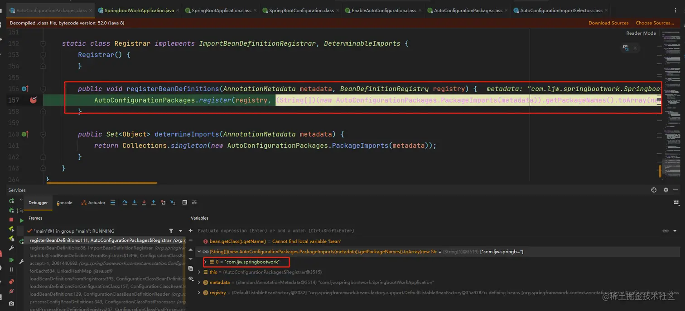

# 自动配置原理

## 启动类

### `@SpringBootApplication`

一切的来自起源`SpringBoot`的启动类，我们发现main方法上面有个注解`@SpringBootApplication`

```java
@SpringBootApplication
public class SpringbootWorkApplication {
    public static void main(String[] args) {
        SpringApplication.run(SpringbootWorkApplication.class, args);
    }
}
```

`@SpringBootApplication` 标注在某个类上说明这个类是 `SpringBoot` 的主配置类， `SpringBoot` 就应该运行这个类的`main`方法来启动 `SpringBoot` 应用；它的本质是一个组合注解，我们点进去查看该类的元信息主要包含3个注解：

```java
@Target({ElementType.TYPE})
@Retention(RetentionPolicy.RUNTIME)
@Documented
@Inherited
@SpringBootConfiguration
@EnableAutoConfiguration
@ComponentScan(
    excludeFilters = {@Filter(
    type = FilterType.CUSTOM,
    classes = {TypeExcludeFilter.class}
), @Filter(
    type = FilterType.CUSTOM,
    classes = {AutoConfigurationExcludeFilter.class}
)}
)
public @interface SpringBootApplication {/..../}
```

- `@SpringBootConfiguration`（里面就是@Configuration，标注当前类为配置类，其实只是做了一层封装改了个名字而已）
- `@EnableAutoConfiguration`（开启自动配置）
- `@ComponentScan`（包扫描）

注：`@Inherited`是一个标识，用来修饰注解，如果一个类用上了@Inherited修饰的注解，那么其子类也会继承这个注解我们下面逐一分析这3个注解作用

####  `@SpringBootConfiguration`

我们继续点`@SpringBootConfiguration`进去查看源码如下：

```java
@Target({ElementType.TYPE})
@Retention(RetentionPolicy.RUNTIME)
@Documented
@Configuration
@Indexed
public @interface SpringBootConfiguration {
    @AliasFor(
        annotation = Configuration.class
    )
    boolean proxyBeanMethods() default true;
}
```

`@Configuration`

标注在某个类上，表示这是一个 `springboot的配置类`。可以向容器中注入组件。

[`@Configuration示例`](6、Bean注册.md)

####  `@ComponentScan`

`@ComponentScan`：配置用于 [Configuration](5、Bean扫描.md#SpringBoot自动扫描Bean) 类的组件扫描指令。

提供与 `Spring XML` 的 `<context:component-scan>` 元素并行的支持。

可以 `basePackageClasses` 或`basePackages `来定义要扫描的特定包。 如果没有定义特定的包，将从声明该注解的类的`包开始扫描`。

#### `@EnableAutoConfiguration`

- `@EnableAutoConfiguration`顾名思义就是：`开启自动导入配置`
- 这个注解是`SpringBoot`的重点，我们下面详细讲解

## `@EnableAutoConfiguration`

源码：

```java
@Target({ElementType.TYPE})
@Retention(RetentionPolicy.RUNTIME)
@Documented
@Inherited
@AutoConfigurationPackage   //自动导包
@Import({AutoConfigurationImportSelector.class}) //自动配置导入选择
public @interface EnableAutoConfiguration {
    String ENABLED_OVERRIDE_PROPERTY = "spring.boot.enableautoconfiguration";

    Class<?>[] exclude() default {};

    String[] excludeName() default {};
}
```

### `@AutoConfigurationPackage`

- 自动导入配置包

- 点进去查看代码：

  ```java
  @Target({ElementType.TYPE})
  @Retention(RetentionPolicy.RUNTIME)
  @Documented
  @Inherited
  @Import({Registrar.class})
  public @interface AutoConfigurationPackage {
      String[] basePackages() default {};
  
      Class<?>[] basePackageClasses() default {};
  }
  ```

  `@Import` 为spring的注解，导入一个配置文件，在`springboot`中为给容器导入一个组件，而导入的组件由 `AutoConfigurationPackages.class`的内部类`Registrar.class` 执行逻辑来决定是如何导入的。

  #### `@Import({Registrar.class})`

`Registrar.class`

```java
static class Registrar implements ImportBeanDefinitionRegistrar, DeterminableImports {
    Registrar() {
    }

    public void registerBeanDefinitions(AnnotationMetadata metadata, BeanDefinitionRegistry registry) {
        //断点
        AutoConfigurationPackages.register(registry, (String[])(new AutoConfigurationPackages.PackageImports(metadata)).getPackageNames().toArray(new String[0]));
    }

    public Set<Object> determineImports(AnnotationMetadata metadata) {
        return Collections.singleton(new AutoConfigurationPackages.PackageImports(metadata));
    }
}
```

注：Registrar实现了`ImportBeanDefinitionRegistrar`类，就可以被注解@Import导入到spring容器里。



运行可以查看到`(String[])(new AutoConfigurationPackages.PackageImports(metadata)).getPackageNames().toArray(new String[0])`的值为`com.ljw.springbootwork`：当前启动类所在的包名

结论：**`@AutoConfigurationPackage` 就是将主配置类（`@SpringBootApplication` 标注的类）所在的包下面所有的组件都扫描注冊到 `spring `容器中。**

###  `@Import({AutoConfigurationImportSelector.class})`

作用：`AutoConfigurationImportSelector`开启自动配置类的导包的选择器，即是带入哪些类，有选择性的导入

点`AutoConfigurationImportSelector.class`进入查看源码，这个类中有两个方法见名知意：

#### `selectImports`：选择需要导入的组件

```java
public String[] selectImports(AnnotationMetadata annotationMetadata) {
    if (!this.isEnabled(annotationMetadata)) {
        return NO_IMPORTS;
    } else {
        AutoConfigurationImportSelector.AutoConfigurationEntry autoConfigurationEntry = this.getAutoConfigurationEntry(annotationMetadata);
        return StringUtils.toStringArray(autoConfigurationEntry.getConfigurations());
    }
}
```

#### `getAutoConfigurationEntry`：根据导入的`@Configuration`类的`AnnotationMetadata`返回`AutoConfigurationImportSelector.AutoConfigurationEntry`

```java
protected AutoConfigurationImportSelector.AutoConfigurationEntry getAutoConfigurationEntry(AnnotationMetadata annotationMetadata) {
    if (!this.isEnabled(annotationMetadata)) {
        return EMPTY_ENTRY;
    } else {
        AnnotationAttributes attributes = this.getAttributes(annotationMetadata);
         // 这打个断点，看看 返回的数据
        List<String> configurations = this.getCandidateConfigurations(annotationMetadata, attributes);
        //删除重复项
        configurations = this.removeDuplicates(configurations);
        Set<String> exclusions = this.getExclusions(annotationMetadata, attributes);
        //检查
        this.checkExcludedClasses(configurations, exclusions);
        //删除需要排除的依赖
        configurations.removeAll(exclusions);
        configurations = this.getConfigurationClassFilter().filter(configurations);
        this.fireAutoConfigurationImportEvents(configurations, exclusions);
        return new AutoConfigurationImportSelector.AutoConfigurationEntry(configurations, exclusions);
    }
}
```

