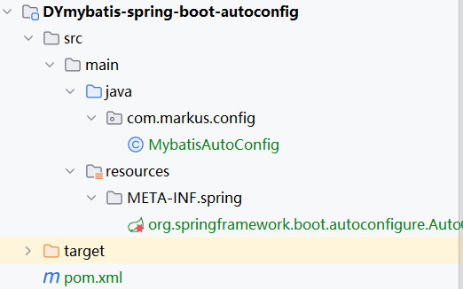

# 自定义`Starter`

## ``SpringBoot``的`Starter`机制

　`SpringBoot`中的`starter`是一种非常重要的机制，能够抛弃以前繁杂的配置，将其统一集成进`starter`，应用者只需要在maven中引入starter依赖，`SpringBoot`就能自动扫描到要加载的信息并启动相应的默认配置。`starter`让我们摆脱了各种依赖库的处理，需要配置各种信息的困扰。`SpringBoot`会自动通过`classpath`路径下的类发现需要的`Bean`，并注册进`IOC`容器。`SpringBoot`提供了针对日常企业应用研发各种场景的`spring-boot-starter`依赖模块。所有这些依赖模块都遵循着约定成俗的默认配置，并允许我们调整这些配置，即遵循“约定大于配置”的理念。

## 自定义`starter`流程

- `Maven:com.Markus.spring.boot:xxxxx-spring-boot-autoconfig:{VERSION}`自动配置功能
- `Maven:com.Markus.spring.boot:xxxxx-spring-boot-starter:{VERSION}`依赖管理功能

## 自定义`MyBatis-Starter`

### 创建`zdymybatis-spring-boot-autoconfigure`模块并配置`META-INF`文件



`MybatisAutoConfig.java`

```java
package com.markus.config;

import org.apache.ibatis.annotations.Mapper;
import org.mybatis.spring.SqlSessionFactoryBean;
import org.mybatis.spring.mapper.MapperScannerConfigurer;
import org.springframework.beans.factory.BeanFactory;
import org.springframework.boot.autoconfigure.AutoConfiguration;
import org.springframework.boot.autoconfigure.AutoConfigurationPackages;
import org.springframework.context.annotation.Bean;

import javax.sql.DataSource;
import java.util.List;

@AutoConfiguration//标注为自动配置的类
public class MybatisAutoConfig {
    //SqlSessionFactoryBean
    @Bean
    public SqlSessionFactoryBean sqlSessionFactoryBean(DataSource dataSource){
        SqlSessionFactoryBean sqlSessionFactoryBean = new SqlSessionFactoryBean();
        sqlSessionFactoryBean.setDataSource(dataSource);
        return sqlSessionFactoryBean;
    }
    //MapperScannerConfigurer
    @Bean
    public MapperScannerConfigurer mapperScannerConfigurer(BeanFactory beanFactory){
        MapperScannerConfigurer mapperScannerConfigurer = new MapperScannerConfigurer();
        List<String> packages = AutoConfigurationPackages.get(beanFactory);
        String p = packages.get(0);
        mapperScannerConfigurer.setBasePackage(p);

        mapperScannerConfigurer.setAnnotationClass(Mapper.class);

        return mapperScannerConfigurer;
    }
}
```

`/META-INF/spring/org.springframework.boot.autoconfigure.AutoConfiguration.imports`

```imports
com.markus.config.MybatisAutoConfig
```

`pom.xml`

```xml
<project xmlns="http://maven.apache.org/POM/4.0.0" xmlns:xsi="http://www.w3.org/2001/XMLSchema-instance"
  xsi:schemaLocation="http://maven.apache.org/POM/4.0.0 http://maven.apache.org/xsd/maven-4.0.0.xsd">
  <modelVersion>4.0.0</modelVersion>

  <groupId>com.markus</groupId>
  <artifactId>DYmybatis-spring-boot-autoconfig</artifactId>
  <version>1.0-SNAPSHOT</version>
  <packaging>jar</packaging>

  <name>DYmybatis-spring-boot-autoconfig</name>
  <url>http://maven.apache.org</url>

  <properties>
    <project.build.sourceEncoding>UTF-8</project.build.sourceEncoding>
  </properties>

  <dependencies>
    <dependency>
      <groupId>org.springframework.boot</groupId>
      <artifactId>spring-boot-starter</artifactId>
      <version>3.2.4</version>
    </dependency>

    <dependency>
      <groupId>org.springframework.boot</groupId>
      <artifactId>spring-boot-starter-data-jdbc</artifactId>
      <version>3.2.4</version>
    </dependency>

    <dependency>
      <groupId>org.mybatis</groupId>
      <artifactId>mybatis</artifactId>
      <version>3.5.14</version>
    </dependency>

    <dependency>
      <groupId>org.mybatis</groupId>
      <artifactId>mybatis-spring</artifactId>
      <version>3.0.3</version>
    </dependency>
  </dependencies>
  <build>
    <plugins>
      <plugin>
        <groupId>org.apache.maven.plugins</groupId>
        <artifactId>maven-compiler-plugin</artifactId>
        <version>3.11.0</version>
        <configuration>
          <source>22</source>
          <target>22</target>
        </configuration>
      </plugin>
    </plugins>
  </build>
</project>
```

### 配置`zdymybatis-spring-boot-starter`

**只用保存`pom.xml`文件**

```xml
<project xmlns="http://maven.apache.org/POM/4.0.0" xmlns:xsi="http://www.w3.org/2001/XMLSchema-instance"
  xsi:schemaLocation="http://maven.apache.org/POM/4.0.0 http://maven.apache.org/xsd/maven-4.0.0.xsd">
  <modelVersion>4.0.0</modelVersion>

  <groupId>com.markus</groupId>
  <artifactId>DYmybatis-spring-boot-starter</artifactId>
  <version>1.0-SNAPSHOT</version>
  <packaging>jar</packaging>

  <name>DYmybatis-spring-boot-starter</name>
  <url>http://maven.apache.org</url>

  <properties>
    <project.build.sourceEncoding>UTF-8</project.build.sourceEncoding>
  </properties>

  <dependencies>
    <dependency>
      <groupId>org.springframework.boot</groupId>
      <artifactId>spring-boot-starter</artifactId>
      <version>3.2.4</version>
    </dependency>

    <dependency>
      <groupId>org.springframework.boot</groupId>
      <artifactId>spring-boot-starter-data-jdbc</artifactId>
      <version>3.2.4</version>
    </dependency>

    <dependency>
      <groupId>org.mybatis</groupId>
      <artifactId>mybatis</artifactId>
      <version>3.5.14</version>
    </dependency>

    <dependency>
    <groupId>org.mybatis</groupId>
    <artifactId>mybatis-spring</artifactId>
    <version>3.0.3</version>
    </dependency>

    <dependency>
      <groupId>com.markus</groupId>
      <artifactId>DYmybatis-spring-boot-autoconfig</artifactId>
      <version>1.0-SNAPSHOT</version>
    </dependency>
  </dependencies>
  <build>
    <plugins>
      <plugin>
        <groupId>org.apache.maven.plugins</groupId>
        <artifactId>maven-compiler-plugin</artifactId>
        <version>3.11.0</version>
        <configuration>
          <source>22</source>
          <target>22</target>
        </configuration>
      </plugin>
    </plugins>
  </build>
</project>
```

可替换[`Mybatis整合`](4、MyBatis整合.md)中`MyBatis`启动类导入

```xml
<?xml version="1.0" encoding="UTF-8"?>
<project xmlns="http://maven.apache.org/POM/4.0.0" xmlns:xsi="http://www.w3.org/2001/XMLSchema-instance"
         xsi:schemaLocation="http://maven.apache.org/POM/4.0.0 https://maven.apache.org/xsd/maven-4.0.0.xsd">
    <modelVersion>4.0.0</modelVersion>
    <parent>
        <groupId>org.springframework.boot</groupId>
        <artifactId>spring-boot-starter-parent</artifactId>
        <version>3.2.4</version>
        <relativePath/> <!-- lookup parent from repository -->
    </parent>
    <groupId>com.markus</groupId>
    <artifactId>Server</artifactId>
    <version>0.0.1-SNAPSHOT</version>
    <name>Server</name>
    <description>Server</description>
    <properties>
        <java.version>22</java.version>
    </properties>
    <dependencies>
        <dependency>
            <groupId>org.springframework.boot</groupId>
            <artifactId>spring-boot-starter-web</artifactId>
        </dependency>
        <dependency>
            <groupId>com.markus</groupId>
            <artifactId>DYmybatis-spring-boot-starter</artifactId>
            <version>1.0-SNAPSHOT</version>
        </dependency>

<!--        <dependency>-->
<!--            <groupId>org.springframework.boot</groupId>-->
<!--            <artifactId>spring-boot-starter-test</artifactId>-->
<!--            <scope>test</scope>-->
<!--        </dependency>-->
        <dependency>
            <groupId>org.postgresql</groupId>
            <artifactId>postgresql</artifactId>
            <scope>runtime</scope>
        </dependency>
<!--        <dependency>-->
<!--            <groupId>org.mybatis.spring.boot</groupId>-->
<!--            <artifactId>mybatis-spring-boot-starter</artifactId>-->
<!--            <version>3.0.3</version>-->
<!--        </dependency>-->
        <dependency>
            <groupId>org.mybatis.spring.boot</groupId>
            <artifactId>mybatis-spring-boot-starter-test</artifactId>
            <version>3.0.3</version>
            <scope>test</scope>
        </dependency>
        <dependency>
            <groupId>org.springframework.boot</groupId>
            <artifactId>spring-boot-starter-actuator</artifactId>
        </dependency>
    </dependencies>

    <build>
        <plugins>
            <plugin>
                <groupId>org.springframework.boot</groupId>
                <artifactId>spring-boot-maven-plugin</artifactId>
            </plugin>
        </plugins>
    </build>

</project>
```

