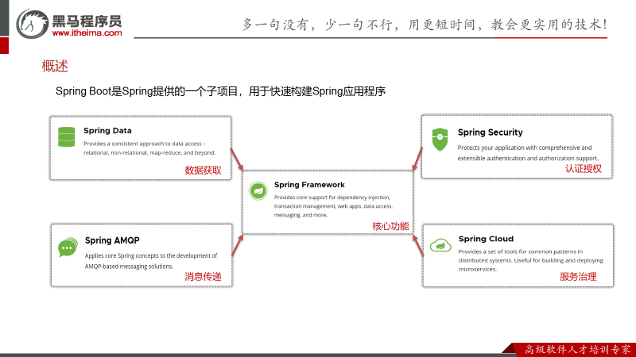
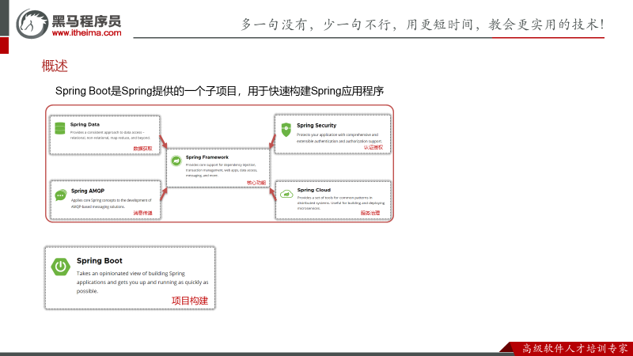

# SpringBoot

## 概述

Spring Boot是由Pivotal团队提供的一套开源框架，可以简化spring应用的创建及部署。它提供了丰富的Spring模块化支持，可以帮助开发者更轻松快捷地构建出企业级应用。Spring Boot通过自动配置功能，降低了复杂性，同时支持基于JVM的多种开源框架，可以缩短开发时间，使开发更加简单和高效。

## SpringBoot的特点

- 起步依赖 **本质上就是一个Maven坐标，整合了完成一个功能需要的所有坐标**
- 自动配置 **遵循约定大约配置的原则，在boot程序启动后，一些bean对象会自动注入到ioc容器，不需要手动声明，简化开发**
- 内嵌的Tomcat、Jetty（无需部署WAR文件）
- 外部化配置
- 不需要XML配置(properties/yml)